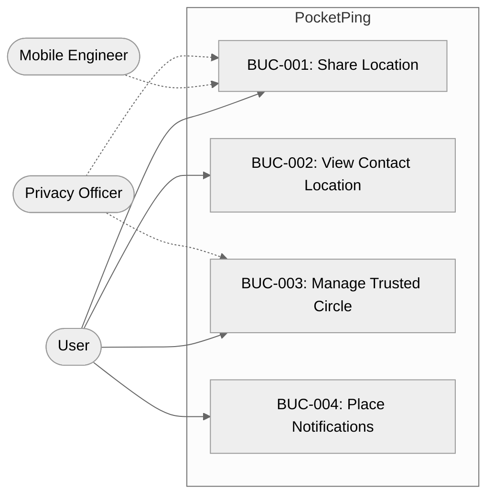
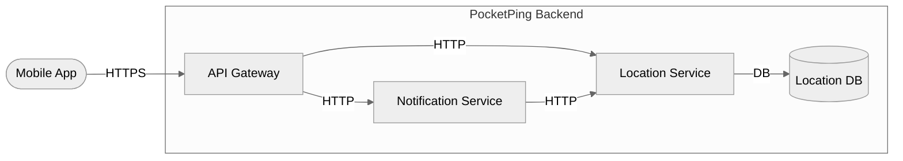
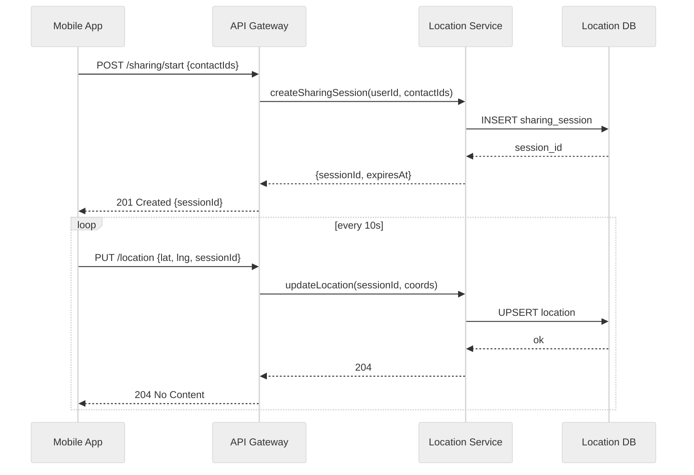
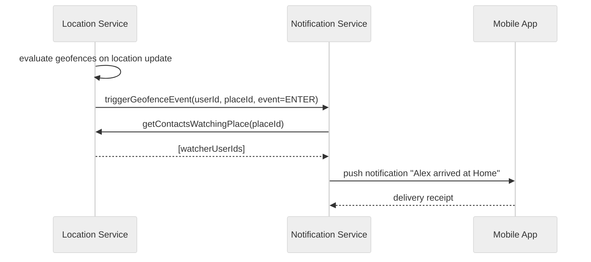

> **This is a calibration example — not a real project.**
> Use it to understand what a complete, well-formed elicitation document looks like.
> The project "PocketPing" and all stakeholders are fictional.
> All elements have Status = Accepted to demonstrate a fully approved artifact.

# Elicitation Document — PocketPing

> **Status:** Approved | **Created:** 2026-04-01 | **Last Updated:** 2026-04-15
>
> This is a living document. On updates: merge and annotate — do not regenerate from scratch.

---

## 1. Project Overview

### 1.1 Background

**Project Name:** PocketPing
**Business Context:** PocketPing is a mobile app that lets users share their real-time location with a trusted circle of contacts. The business driver is personal safety: users want to let family members or close friends know where they are without exposing their location publicly. The core value proposition is simplicity — share location with one tap, revoke with one tap.
**Primary Contacts:** Alex Chen (Product Owner) — alex.chen@pocketping.example.com

### 1.2 Problem Statement

People in personal safety situations — walking home alone, meeting strangers, travelling — want a trusted contact to know where they are without broadcasting their location publicly or relying on fragmented workarounds (manual SMS, voice calls, or third-party apps with excessive data collection). Existing solutions either require the contact to actively ask ("where are you?") or expose location data to platforms with opaque privacy practices. **Impact if unsolved:** users in potentially unsafe situations cannot discreetly signal their whereabouts to trusted people; families cannot verify that a vulnerable relative arrived safely without an explicit check-in call.

### 1.3 Scope

**In scope:** iOS and Android mobile apps, real-time location sharing with invited contacts, location history (last 24 hours), push notifications when a trusted contact arrives at or leaves a user-defined geographic boundary.
**Out of scope:** web client, public location feeds, advertising features, social features beyond the trusted circle, third-party data sharing, location sharing with more than the explicitly invited contacts.

---

## 2. Stakeholders

<!-- ID format: SH-001, SH-002, ... (sequential, never reused) -->

| ID | Name | Role | Organization | Primary Concerns | Contact | Source | Status | Accepted Date |
|----|------|------|-------------|-----------------|---------|--------|--------|---------------|
| SH-001 | Alex Chen | Product Owner | PocketPing Ltd | Feature scope, user experience quality, delivery timeline | alex.chen@pocketping.example.com | product-brief.md | Accepted | 2026-04-08 |
| SH-002 | Priya Nair | Lead Mobile Engineer | PocketPing Ltd | Technical feasibility, battery impact of location polling, API latency | priya.nair@pocketping.example.com | technical-constraints.md | Accepted | 2026-04-08 |
| SH-003 | Marcus Johansson | Privacy & Compliance Officer | PocketPing Ltd | GDPR compliance, data minimisation, user consent flows, data retention | m.johansson@pocketping.example.com | stakeholder-notes.md | Accepted | 2026-04-08 |
| SH-004 | User Research Rep | End User Representative | External (User Panel) | Simplicity, privacy controls, notification relevance, battery life | research@pocketping.example.com | user-research-summary.md | Accepted | 2026-04-08 |

---

## 3. Business Use Cases

<!-- ID format: BUC-001, BUC-002, ... (sequential, never reused) -->

### 3.0 Use Case Diagram

---

### BUC-001: Share Location

- **Description:** A user enables real-time location sharing so that members of their trusted circle can see where they are on a map.
- **Primary Actor:** SH-001 (User)
- **Trigger:** User taps "Share My Location" and selects one or more contacts or shares with the full circle.
- **Expected Outcome:** Selected contacts receive a live location pin that updates automatically. The sharing user can see who is viewing their location.
- **Stakeholders:** SH-001, SH-002, SH-003
- **Source:** product-brief.md
- **Status:** Accepted
- **Accepted By:** SH-001
- **Accepted Date:** 2026-04-08

---

### BUC-002: View Contact Location

- **Description:** A user views the current or recent location of a trusted contact who has shared their location.
- **Primary Actor:** SH-001 (User)
- **Trigger:** User opens the app and selects a contact who has active location sharing.
- **Expected Outcome:** The map displays the contact's current position, last-updated timestamp, and movement trail for the past 24 hours.
- **Stakeholders:** SH-001, SH-002
- **Source:** product-brief.md
- **Status:** Accepted
- **Accepted By:** SH-001
- **Accepted Date:** 2026-04-08

---

### BUC-003: Manage Trusted Circle

- **Description:** A user adds, removes, or reviews the contacts with whom they share (or receive) location data.
- **Primary Actor:** SH-001 (User)
- **Trigger:** User navigates to the Trusted Circle management screen.
- **Expected Outcome:** User can invite new contacts via link or phone number, revoke access for existing contacts, and see a list of who currently has access to their location.
- **Stakeholders:** SH-001, SH-003
- **Source:** product-brief.md, stakeholder-notes.md
- **Status:** Accepted
- **Accepted By:** SH-001
- **Accepted Date:** 2026-04-08

---

### BUC-004: Place Notifications

- **Description:** A user defines a named geographic area ("Place") and configures notifications to fire when a trusted contact arrives at or leaves that place.
- **Primary Actor:** SH-001 (User)
- **Trigger:** User taps "Add Place" and draws or searches for a geographic boundary.
- **Expected Outcome:** The system sends a push notification within 60 seconds when a tracked contact enters or exits the defined boundary.
- **Stakeholders:** SH-001, SH-002
- **Source:** product-brief.md
- **Status:** Accepted
- **Accepted By:** SH-001
- **Accepted Date:** 2026-04-10

---

## 4. System Architecture Overview

> Diagrams in this section describe the software structure as understood during elicitation.

### 4.0 Component Overview

- **Source:** technical-constraints.md, stakeholder-notes.md
- **Status:** Accepted
- **Accepted By:** SH-002
- **Accepted Date:** 2026-04-10

---

### SEQ-001: Share Location Flow

- **Business Use Case:** BUC-001
- **Description:** How the mobile client initiates location sharing and the backend begins persisting location updates.
- **Source:** technical-constraints.md
- **Status:** Accepted
- **Accepted By:** SH-002
- **Accepted Date:** 2026-04-10

---

### SEQ-002: Place Notification Flow

- **Business Use Case:** BUC-004
- **Description:** How the backend detects a contact entering a defined place boundary and delivers a push notification.
- **Source:** technical-constraints.md
- **Status:** Accepted
- **Accepted By:** SH-002
- **Accepted Date:** 2026-04-10

---

## 5. Requirements

> The key words **SHALL**, **SHALL NOT**, **SHOULD**, **SHOULD NOT**, and **MAY** in this section are to be interpreted as described in [RFC 2119](https://www.rfc-editor.org/rfc/rfc2119). Mapping: Must Have → SHALL | Should Have → SHOULD | Could Have → MAY.

### 5.1 Functional Requirements

#### FR-001: Start Location Sharing Session

- **Description:** The system SHALL allow an authenticated user to initiate a real-time location sharing session by selecting one or more contacts from their trusted circle. The system SHALL begin broadcasting the user's GPS location to the selected contacts within 5 seconds of the user confirming the session.
- **Priority:** Must Have
- **Business Use Case:** BUC-001
- **Stakeholder:** SH-001
- **Source:** product-brief.md
- **Rationale:** Core value proposition — without this, the app has no function.
- **Acceptance Criteria:** See Section 6 — AC-FR-001-01, AC-FR-001-02
- **Status:** Accepted
- **Accepted By:** SH-001
- **Accepted Date:** 2026-04-10

---

#### FR-002: Stop Location Sharing

- **Description:** The system SHALL allow a user to stop all active location sharing sessions at any time. All sessions SHALL be terminated within 3 seconds of the stop action. The system SHALL NOT deliver further location updates to any contact after session termination.
- **Priority:** Must Have
- **Business Use Case:** BUC-001
- **Stakeholder:** SH-001
- **Source:** product-brief.md
- **Rationale:** Privacy control — users must be able to revoke sharing instantly.
- **Acceptance Criteria:** See Section 6 — AC-FR-002-01
- **Status:** Accepted
- **Accepted By:** SH-001
- **Accepted Date:** 2026-04-10

---

#### FR-003: View Contact Live Location

- **Description:** The system SHALL display the current GPS position of any trusted contact who has an active sharing session on a map, represented as a location pin with a last-updated timestamp visible to the viewing user.
- **Priority:** Must Have
- **Business Use Case:** BUC-002
- **Stakeholder:** SH-001
- **Source:** product-brief.md
- **Rationale:** Complementary to FR-001 — sharing is only useful if the recipient can see the location.
- **Acceptance Criteria:** See Section 6 — AC-FR-003-01
- **Status:** Accepted
- **Accepted By:** SH-001
- **Accepted Date:** 2026-04-10

---

#### FR-004: View 24-Hour Location Trail

- **Description:** The system SHOULD render a movement trail for a contact being viewed, displayed as a polyline on the map, covering the contact's path for the previous 24 hours.
- **Priority:** Should Have
- **Business Use Case:** BUC-002
- **Stakeholder:** SH-001
- **Source:** product-brief.md
- **Rationale:** Adds context to the current location — useful for safety scenarios ("did they arrive home?").
- **Acceptance Criteria:** See Section 6 — AC-FR-004-01
- **Status:** Accepted
- **Accepted By:** SH-001
- **Accepted Date:** 2026-04-10

---

#### FR-005: Invite Contact to Trusted Circle

- **Description:** The system SHALL allow a user to invite a new contact to their trusted circle via a shareable invite link or by entering a phone number. The invited contact SHALL receive an in-app notification and SHALL explicitly accept the invitation before any location data is shared with them.
- **Priority:** Must Have
- **Business Use Case:** BUC-003
- **Stakeholder:** SH-001
- **Source:** product-brief.md, stakeholder-notes.md
- **Rationale:** Explicit consent is required before location sharing can occur — regulatory and ethical requirement.
- **Acceptance Criteria:** See Section 6 — AC-FR-005-01, AC-FR-005-02
- **Status:** Accepted
- **Accepted By:** SH-001
- **Accepted Date:** 2026-04-10

---

#### FR-006: Revoke Contact Access

- **Description:** The system SHALL allow a user to remove any contact from their trusted circle at any time. The system SHALL immediately terminate all active location sharing sessions with the removed contact upon removal.
- **Priority:** Must Have
- **Business Use Case:** BUC-003
- **Stakeholder:** SH-001
- **Source:** product-brief.md
- **Rationale:** GDPR Article 7(3) — withdrawal of consent must be as easy as giving it.
- **Acceptance Criteria:** See Section 6 — AC-FR-006-01
- **Status:** Accepted
- **Accepted By:** SH-003
- **Accepted Date:** 2026-04-10

---

#### FR-007: Define a Place

- **Description:** The system SHOULD allow a user to create a named geographic boundary ("Place") by searching for an address or dropping a pin and adjusting a radius (50m–5km). The system SHALL store the Place and associate it with the user's account.
- **Priority:** Should Have
- **Business Use Case:** BUC-004
- **Stakeholder:** SH-001
- **Source:** product-brief.md
- **Rationale:** Places are the foundation for geofence notifications (BUC-004).
- **Acceptance Criteria:** See Section 6 — AC-FR-007-01
- **Status:** Accepted
- **Accepted By:** SH-001
- **Accepted Date:** 2026-04-10

---

#### FR-008: Geofence Notification

- **Description:** The system SHOULD send the user a push notification within 60 seconds when a trusted contact with an active sharing session enters or exits a user-defined Place boundary.
- **Priority:** Should Have
- **Business Use Case:** BUC-004
- **Stakeholder:** SH-001
- **Source:** product-brief.md
- **Rationale:** Primary value-add feature beyond basic location sharing.
- **Acceptance Criteria:** See Section 6 — AC-FR-008-01
- **Status:** Accepted
- **Accepted By:** SH-001
- **Accepted Date:** 2026-04-10

---

### 5.2 Non-Functional Requirements

#### NFR-001: Location Update Latency

- **Description:** The system SHALL propagate location updates from the sharing user's device to a viewing contact's device with sufficiently low latency to maintain a sense of real-time presence. See Measurable Target for the specific threshold.
- **Category:** Performance
- **Priority:** Must Have
- **Measurable Target:** End-to-end location update latency must be < 5 seconds at p95 under 10,000 concurrent sharing sessions.
- **Business Use Case:** BUC-001, BUC-002
- **Source:** technical-constraints.md
- **Acceptance Criteria:** See Section 6 — AC-NFR-001-01
- **Status:** Accepted
- **Accepted By:** SH-002
- **Accepted Date:** 2026-04-10

---

#### NFR-002: Session Authentication

- **Description:** The system SHALL require valid authentication on all API endpoints. The system SHALL reject all unauthenticated requests.
- **Category:** Security
- **Priority:** Must Have
- **Measurable Target:** 100% of API endpoints return HTTP 401 for requests with no valid session token. Zero endpoints accessible without authentication in penetration test.
- **Business Use Case:** BUC-001, BUC-002, BUC-003
- **Source:** technical-constraints.md
- **Acceptance Criteria:** See Section 6 — AC-NFR-002-01
- **Status:** Accepted
- **Accepted By:** SH-002
- **Accepted Date:** 2026-04-10

---

#### NFR-003: Data Retention Compliance

- **Description:** The system SHALL NOT retain location data beyond the minimum period necessary as required by GDPR Article 5(1)(e) (storage limitation principle). See Measurable Target for the specific retention window.
- **Category:** Compliance
- **Priority:** Must Have
- **Measurable Target:** All location records with a timestamp older than 30 days from the current date must be automatically deleted within 24 hours of reaching that threshold.
- **Business Use Case:** BUC-001
- **Source:** stakeholder-notes.md
- **Acceptance Criteria:** See Section 6 — AC-NFR-003-01
- **Status:** Accepted
- **Accepted By:** SH-003
- **Accepted Date:** 2026-04-10

---

#### NFR-004: Battery Impact

- **Description:** The system SHOULD minimise battery consumption caused by background location polling on the user's device. See Measurable Target for the specific threshold.
- **Category:** Usability
- **Priority:** Should Have
- **Measurable Target:** Background location polling must consume < 5% of device battery per hour when actively sharing, measured on iPhone 14 and Samsung Galaxy S23 under standard lab conditions.
- **Business Use Case:** BUC-001
- **Source:** technical-constraints.md, user-research-summary.md
- **Acceptance Criteria:** See Section 6 — AC-NFR-004-01
- **Status:** Accepted
- **Accepted By:** SH-004
- **Accepted Date:** 2026-04-10

---

### 5.3 Constraints

#### CON-001: Platform Scope

- **Description:** v1 of PocketPing is iOS and Android mobile only. No web client, browser extension, or desktop app will be built in v1.
- **Type:** Organizational
- **Impact:** All UI/UX must be designed for mobile touch interfaces. No API endpoints need to serve HTML or support browser sessions.
- **Source:** product-brief.md
- **Status:** Accepted
- **Accepted By:** SH-001
- **Accepted Date:** 2026-04-08

---

#### CON-002: GDPR Applicability

- **Description:** PocketPing will be available in the EU. All processing of location data (a special category of personal data under GDPR) must comply with GDPR Articles 5, 6, 7, and 17.
- **Type:** Regulatory
- **Impact:** Location data requires explicit, informed consent (covered by FR-005). Retention must be limited (covered by NFR-003). Data subjects must be able to revoke consent (covered by FR-002, FR-006).
- **Source:** stakeholder-notes.md
- **Status:** Accepted
- **Accepted By:** SH-003
- **Accepted Date:** 2026-04-08

---

#### CON-003: No Third-Party Analytics in Core Flow

- **Description:** Third-party analytics SDKs (Firebase Analytics, Amplitude, etc.) must not be included in the location data transmission path or store any location coordinates.
- **Type:** Regulatory
- **Impact:** Analytics must be implemented using only anonymised event names. No analytics call may include coordinates, place names, or contact IDs.
- **Source:** stakeholder-notes.md
- **Status:** Accepted
- **Accepted By:** SH-003
- **Accepted Date:** 2026-04-10

---

### 5.4 Assumptions

| ID | Description | Owner (SH-xxx) | Source | Rationale | Impact if Wrong | Status | Accepted By | Accepted Date |
|----|-------------|----------------|--------|-----------|-----------------|--------|-------------|---------------|
| ASMP-001 | Target users have smartphones running iOS 16+ or Android 12+ | SH-004 | user-research-summary.md | Market research shows > 90% of target demographics run these OS versions or newer | If wrong: significant share of users cannot install the app; must support older OS versions, increasing test matrix and development cost | Validated | SH-001 | 2026-04-10 |
| ASMP-002 | The push notification infrastructure (APNs for iOS, FCM for Android) will maintain its current API contracts throughout the 18-month delivery window | SH-002 | technical-constraints.md | Both Apple and Google have maintained backwards compatibility for 3+ years on current API versions | If wrong: notification delivery will break; the geofence notification feature (BUC-004) will be inoperable until the integration is updated | Validated | SH-002 | 2026-04-10 |
| ASMP-003 | Users in the target market have sufficient mobile data plans to support 10-second location polling without incurring unexpected data charges | SH-004 | user-research-summary.md | Location update packets are < 200 bytes; 10-second polling generates < 2 MB/day | If wrong: battery and data cost complaints will drive uninstalls; must offer configurable polling frequency | Validated | SH-004 | 2026-04-12 |

---

### 5.5 Risks

| ID | Description | Likelihood (H/M/L) | Impact (H/M/L) | Owner (SH-xxx) | Mitigation | Source | Status | Accepted By | Accepted Date |
|----|-------------|-------------------|----------------|----------------|-----------|--------|--------|-------------|---------------|
| RSK-001 | iOS background location access policy changes (Apple could restrict background location in a future OS update) | L | H | SH-002 | Monitor Apple Developer release notes; design the location sharing session to gracefully degrade to foreground-only if background access is revoked; notify the sharing user when location updates have paused | technical-constraints.md | Mitigated | SH-002 | 2026-04-12 |
| RSK-002 | GDPR regulatory interpretation changes: supervisory authorities could issue new guidance that requires stricter consent mechanisms than currently planned | M | H | SH-003 | Consent flow is designed as a standalone module; reconfiguring consent screens does not require a full release; legal review checkpoint scheduled at 6-month mark | stakeholder-notes.md | Mitigated | SH-003 | 2026-04-12 |
| RSK-003 | Location DB performance bottleneck at scale: the write rate from 10,000 concurrent sharing sessions (1 write/10s per session = 1,000 writes/sec) may exceed single-instance PostgreSQL capacity | M | M | SH-002 | Load test at 150% of target concurrency before launch; design Location Service to support horizontal read replicas from day one; timebox investigation of write partitioning if needed | technical-constraints.md | Mitigated | SH-002 | 2026-04-12 |

---

## 6. Acceptance Criteria

<!-- AC QUALITY RULES — apply at generation time and review time:
     1. ONE observable outcome per AC. If a Then clause contains two independent assertions joined by AND
        (or tests two separate features), split into separate ACs.
     2. Each AC must be independently executable — no AC should require another AC's post-condition as its starting state.
     3. Given must describe a complete, reproducible starting state.
     4. When must describe exactly one actor action or one system event.
     5. Then must be a verifiable, observable output — not an intent ("the system should try to...").
     6. NFR ACs: Criterion must copy the exact measurable threshold from the parent NFR's Measurable Target field verbatim.
-->

### FR-001 Acceptance Criteria

- **AC-FR-001-01**
  - **Given:** A registered user has at least one contact in their trusted circle with the app installed
  - **When:** The user taps "Share My Location" and selects one contact, then confirms
  - **Then:** Within 5 seconds, the selected contact's app displays the sharing user's location pin on the map
  - **Status:** Accepted
  - **Accepted By:** SH-001
  - **Accepted Date:** 2026-04-12

- **AC-FR-001-02**
  - **Given:** A registered user has initiated a sharing session with a contact
  - **When:** The sharing user's device moves 50 metres from the last recorded position
  - **Then:** The contact's app updates the location pin to the new position within 5 seconds
  - **Status:** Accepted
  - **Accepted By:** SH-001
  - **Accepted Date:** 2026-04-12

---

### FR-002 Acceptance Criteria

- **AC-FR-002-01**
  - **Given:** A user has an active location sharing session with at least one contact
  - **When:** The user taps "Stop Sharing"
  - **Then:** Within 3 seconds, the contact's app stops receiving location updates and the sharing user's pin is removed from the contact's map view
  - **Status:** Accepted
  - **Accepted By:** SH-001
  - **Accepted Date:** 2026-04-12

---

### FR-003 Acceptance Criteria

- **AC-FR-003-01**
  - **Given:** A contact has an active sharing session with the viewing user
  - **When:** The viewing user opens the contact's profile in the app
  - **Then:** A map is displayed showing the contact's current location pin and a timestamp indicating when the location was last updated
  - **Status:** Accepted
  - **Accepted By:** SH-001
  - **Accepted Date:** 2026-04-12

---

### FR-004 Acceptance Criteria

- **AC-FR-004-01**
  - **Given:** A contact has been sharing their location for at least 1 hour
  - **When:** The viewing user selects the contact and taps "Show Trail"
  - **Then:** A polyline is drawn on the map connecting the contact's recorded positions for the previous 24 hours, from oldest to most recent
  - **Status:** Accepted
  - **Accepted By:** SH-001
  - **Accepted Date:** 2026-04-12

---

### FR-005 Acceptance Criteria

Note: FR-005 contains two independently testable behaviours. They are split into separate ACs to comply with the single-outcome rule.

- **AC-FR-005-01**
  - **Given:** A registered user is on the "Add Contact" screen
  - **When:** The user enters a phone number and taps "Send Invite"
  - **Then:** The target phone number receives an SMS containing a unique invite link and the inviting user's display name
  - **Status:** Accepted
  - **Accepted By:** SH-001
  - **Accepted Date:** 2026-04-12

- **AC-FR-005-02**
  - **Given:** An invited contact receives the invite link and taps "Accept"
  - **When:** The contact confirms acceptance in the app
  - **Then:** The inviting user's trusted circle is updated to include the new contact, and location sharing between the two users becomes possible
  - **Status:** Accepted
  - **Accepted By:** SH-001
  - **Accepted Date:** 2026-04-12

---

### FR-006 Acceptance Criteria

- **AC-FR-006-01**
  - **Given:** A user has a contact in their trusted circle with an active location sharing session
  - **When:** The user navigates to the contact's profile and taps "Remove from Circle", then confirms
  - **Then:** All active sharing sessions between the user and the removed contact are terminated immediately; the removed contact's app can no longer display the user's location
  - **Status:** Accepted
  - **Accepted By:** SH-003
  - **Accepted Date:** 2026-04-12

---

### FR-007 Acceptance Criteria

- **AC-FR-007-01**
  - **Given:** A user is on the "Add Place" screen
  - **When:** The user searches for an address, drops a pin on the result, sets a radius of 200m, enters the name "Home", and taps "Save"
  - **Then:** A Place named "Home" with a 200m radius centred on the selected address is stored in the user's account and appears in their Places list
  - **Status:** Accepted
  - **Accepted By:** SH-001
  - **Accepted Date:** 2026-04-12

---

### FR-008 Acceptance Criteria

- **AC-FR-008-01**
  - **Given:** A user has defined a Place with a 300m radius, and a trusted contact has an active sharing session
  - **When:** The contact's location crosses the 300m boundary (entering or exiting)
  - **Then:** The user receives a push notification within 60 seconds of the boundary crossing, containing the contact's display name, the Place name, and whether they arrived or left
  - **Status:** Accepted
  - **Accepted By:** SH-001
  - **Accepted Date:** 2026-04-12

---

### NFR-001 Acceptance Criteria

- **AC-NFR-001-01**
  - **Criterion:** End-to-end location update latency must be < 5 seconds at p95 under 10,000 concurrent sharing sessions.
  - **Status:** Accepted
  - **Accepted By:** SH-002
  - **Accepted Date:** 2026-04-12

---

### NFR-002 Acceptance Criteria

- **AC-NFR-002-01**
  - **Criterion:** 100% of API endpoints return HTTP 401 for requests with no valid session token. Zero endpoints accessible without authentication in penetration test.
  - **Status:** Accepted
  - **Accepted By:** SH-002
  - **Accepted Date:** 2026-04-12

---

### NFR-003 Acceptance Criteria

- **AC-NFR-003-01**
  - **Criterion:** All location records with a timestamp older than 30 days from the current date must be automatically deleted within 24 hours of reaching that threshold.
  - **Status:** Accepted
  - **Accepted By:** SH-003
  - **Accepted Date:** 2026-04-12

---

### NFR-004 Acceptance Criteria

- **AC-NFR-004-01**
  - **Criterion:** Background location polling must consume < 5% of device battery per hour when actively sharing, measured on iPhone 14 and Samsung Galaxy S23 under standard lab conditions.
  - **Status:** Accepted
  - **Accepted By:** SH-004
  - **Accepted Date:** 2026-04-12

---

## 7. Open Questions

<!-- Severity values: Critical (blocks APPROVED) | High (affects scope/architecture) | Medium (informational) | Low (cosmetic/deferred) -->

| ID | Question | Context | Severity | Raised By | Assigned To | Deadline | Status | Answer |
|----|----------|---------|----------|-----------|-------------|----------|--------|--------|
| OQ-001 | What is the maximum number of contacts a user can have in their trusted circle? | Affects database schema design, UI affordances, and geofence notification fan-out logic. | Critical | elicit skill | SH-001 | 2026-04-08 | Resolved | Maximum of 20 contacts per user in v1. This is a product decision, not a technical constraint. (Source: product-brief.md revision 2) |
| OQ-002 | Should location history older than 24 hours be fully deleted or just hidden from the UI? | Affects data retention design and GDPR compliance posture for NFR-003. | High | SH-003 | SH-003 | 2026-04-10 | Resolved | Fully deleted from the database — not soft-deleted or hidden. Retention of hidden data would still constitute processing under GDPR. (Source: stakeholder-notes.md follow-up) |
| OQ-003 | Are there accessibility requirements (e.g., VoiceOver, TalkBack support) for v1? | Affects UI implementation scope and test plan. Not covered in current inputs. | Medium | elicit skill | SH-001 | 2026-04-15 | Deferred | Accessibility compliance will be addressed in v1.1. v1 will not be formally tested for WCAG compliance. Deferred with product owner agreement. |
| OQ-004 | What happens to an active sharing session if the sharing user closes the app? Does sharing continue in the background? | Affects battery impact design and user expectation setting for NFR-004. | High | SH-002 | SH-002 | 2026-04-10 | Resolved | Sharing continues in the background using platform background location APIs, subject to OS restrictions. The user is shown a persistent notification indicating that sharing is active. (Source: technical-constraints.md) |

---

## 8. Acceptance Status Overview

> Auto-populated by the `/elicit` skill on every run. Do not edit manually.

### Stakeholders

| ID | Name | Role | Status | Accepted Date |
|----|------|------|--------|---------------|
| SH-001 | Alex Chen | Product Owner | Accepted | 2026-04-08 |
| SH-002 | Priya Nair | Lead Mobile Engineer | Accepted | 2026-04-08 |
| SH-003 | Marcus Johansson | Privacy & Compliance Officer | Accepted | 2026-04-08 |
| SH-004 | User Research Rep | End User Representative | Accepted | 2026-04-08 |

### Business Use Cases

| ID | Title | Accepted By | Status | Accepted Date |
|----|-------|-------------|--------|---------------|
| BUC-001 | Share Location | SH-001 | Accepted | 2026-04-08 |
| BUC-002 | View Contact Location | SH-001 | Accepted | 2026-04-08 |
| BUC-003 | Manage Trusted Circle | SH-001 | Accepted | 2026-04-08 |
| BUC-004 | Place Notifications | SH-001 | Accepted | 2026-04-10 |

### Component Overview

| ID | Title | Accepted By | Status | Accepted Date |
|----|-------|-------------|--------|---------------|
| COMP-001 | Component Overview | SH-002 | Accepted | 2026-04-10 |

### Sequence Diagrams

| ID | Title | BUC | Accepted By | Status | Accepted Date |
|----|-------|-----|-------------|--------|---------------|
| SEQ-001 | Share Location Flow | BUC-001 | SH-002 | Accepted | 2026-04-10 |
| SEQ-002 | Place Notification Flow | BUC-004 | SH-002 | Accepted | 2026-04-10 |

### Functional Requirements

| ID | Title | Accepted By | Status | Accepted Date |
|----|-------|-------------|--------|---------------|
| FR-001 | Start Location Sharing Session | SH-001 | Accepted | 2026-04-10 |
| FR-002 | Stop Location Sharing | SH-001 | Accepted | 2026-04-10 |
| FR-003 | View Contact Live Location | SH-001 | Accepted | 2026-04-10 |
| FR-004 | View 24-Hour Location Trail | SH-001 | Accepted | 2026-04-10 |
| FR-005 | Invite Contact to Trusted Circle | SH-001 | Accepted | 2026-04-10 |
| FR-006 | Revoke Contact Access | SH-003 | Accepted | 2026-04-10 |
| FR-007 | Define a Place | SH-001 | Accepted | 2026-04-10 |
| FR-008 | Geofence Notification | SH-001 | Accepted | 2026-04-10 |

### Non-Functional Requirements

| ID | Title | Accepted By | Status | Accepted Date |
|----|-------|-------------|--------|---------------|
| NFR-001 | Location Update Latency | SH-002 | Accepted | 2026-04-10 |
| NFR-002 | Session Authentication | SH-002 | Accepted | 2026-04-10 |
| NFR-003 | Data Retention Compliance | SH-003 | Accepted | 2026-04-10 |
| NFR-004 | Battery Impact | SH-004 | Accepted | 2026-04-10 |

### Constraints

| ID | Title | Accepted By | Status | Accepted Date |
|----|-------|-------------|--------|---------------|
| CON-001 | Platform Scope | SH-001 | Accepted | 2026-04-08 |
| CON-002 | GDPR Applicability | SH-003 | Accepted | 2026-04-08 |
| CON-003 | No Third-Party Analytics in Core Flow | SH-003 | Accepted | 2026-04-10 |

### Assumptions

| ID | Description (short) | Owner | Status | Accepted Date |
|----|---------------------|-------|--------|---------------|
| ASMP-001 | Users have iOS 16+ or Android 12+ | SH-004 | Accepted | 2026-04-10 |
| ASMP-002 | APNs/FCM API contracts stable for 18 months | SH-002 | Accepted | 2026-04-10 |
| ASMP-003 | Users have data plans supporting 10s polling | SH-004 | Accepted | 2026-04-12 |

### Risks

| ID | Description (short) | Owner | Likelihood | Impact | Status | Accepted Date |
|----|---------------------|-------|-----------|--------|--------|---------------|
| RSK-001 | iOS background location policy change | SH-002 | L | H | Accepted | 2026-04-12 |
| RSK-002 | GDPR regulatory interpretation change | SH-003 | M | H | Accepted | 2026-04-12 |
| RSK-003 | Location DB write bottleneck at scale | SH-002 | M | M | Accepted | 2026-04-12 |

### Acceptance Criteria

| ID | Parent | Accepted By | Status | Accepted Date |
|----|--------|-------------|--------|---------------|
| AC-FR-001-01 | FR-001 | SH-001 | Accepted | 2026-04-12 |
| AC-FR-001-02 | FR-001 | SH-001 | Accepted | 2026-04-12 |
| AC-FR-002-01 | FR-002 | SH-001 | Accepted | 2026-04-12 |
| AC-FR-003-01 | FR-003 | SH-001 | Accepted | 2026-04-12 |
| AC-FR-004-01 | FR-004 | SH-001 | Accepted | 2026-04-12 |
| AC-FR-005-01 | FR-005 | SH-001 | Accepted | 2026-04-12 |
| AC-FR-005-02 | FR-005 | SH-001 | Accepted | 2026-04-12 |
| AC-FR-006-01 | FR-006 | SH-003 | Accepted | 2026-04-12 |
| AC-FR-007-01 | FR-007 | SH-001 | Accepted | 2026-04-12 |
| AC-FR-008-01 | FR-008 | SH-001 | Accepted | 2026-04-12 |
| AC-NFR-001-01 | NFR-001 | SH-002 | Accepted | 2026-04-12 |
| AC-NFR-002-01 | NFR-002 | SH-002 | Accepted | 2026-04-12 |
| AC-NFR-003-01 | NFR-003 | SH-003 | Accepted | 2026-04-12 |
| AC-NFR-004-01 | NFR-004 | SH-004 | Accepted | 2026-04-12 |

---

## 9. Traceability Summary

> Auto-populated by the `/trace` skill.

| Requirement | Business Use Case | Stakeholder | Epic | User Story | Test Case |
|-------------|------------------|-------------|------|------------|-----------|
| FR-001 | BUC-001 | SH-001 | — | — | — |
| FR-002 | BUC-001 | SH-001 | — | — | — |
| FR-003 | BUC-002 | SH-001 | — | — | — |
| FR-004 | BUC-002 | SH-001 | — | — | — |
| FR-005 | BUC-003 | SH-001 | — | — | — |
| FR-006 | BUC-003 | SH-003 | — | — | — |
| FR-007 | BUC-004 | SH-001 | — | — | — |
| FR-008 | BUC-004 | SH-001 | — | — | — |
| NFR-001 | BUC-001, BUC-002 | SH-002 | — | — | — |
| NFR-002 | BUC-001, BUC-002, BUC-003 | SH-002 | — | — | — |
| NFR-003 | BUC-001 | SH-003 | — | — | — |
| NFR-004 | BUC-001 | SH-004 | — | — | — |

---

## 10. Revision History

| Version | Date | Changed By | Changes |
|---------|------|-----------|---------|
| 1.0 | 2026-04-01 | elicit skill (initial run) | Initial creation from product-brief.md and stakeholder-notes.md |
| 1.1 | 2026-04-08 | elicit skill (incremental) | Added SH-003, SH-004; added BUC-004; resolved OQ-001; updated FR-005 with consent requirement |
| 1.2 | 2026-04-10 | elicit skill (incremental) | Added technical-constraints.md; added FR-007, FR-008, NFR-001–004, CON-001–003; added COMP-001, SEQ-001, SEQ-002; resolved OQ-002, OQ-004 |
| 1.3 | 2026-04-15 | Human review (SH-001) | Approved all elements; deferred OQ-003 to v1.1 |
