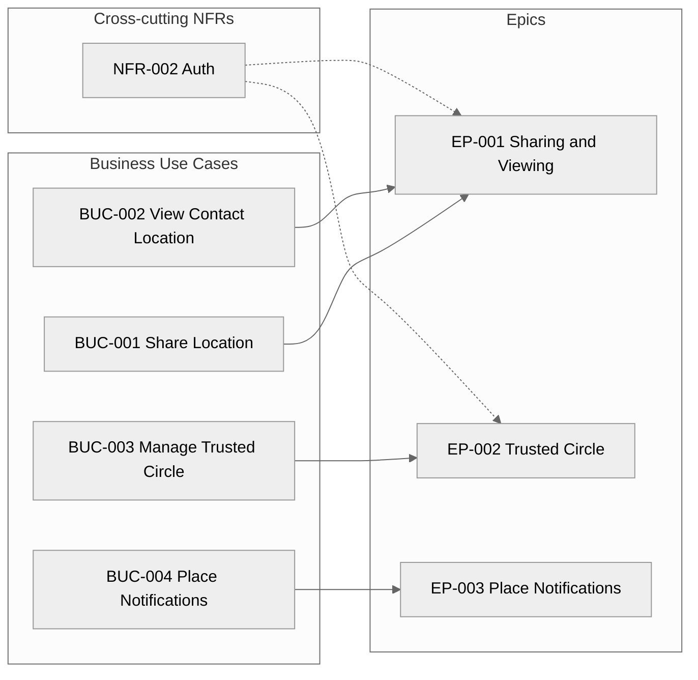

> **This is a calibration example — not a real project.**
> Use it to understand what a complete, well-formed Epic set looks like after `/create-epics` has run on the matching elicitation example at `examples/01-elicitation/elicitation-document-example.md`.
> The project "PocketPing" and all stakeholders are fictional. **All Epics are in `Status = Pending`** — the human reviewer would either Accept them as-is or use the Open Questions in Section 6 (notably the merge-confirmation OQ-005 on EP-001) to redirect the structure before APPROVED.
> The elicitation example shows the fully-Accepted upstream artifact; this example shows the Phase-2 output **before** human acceptance — the two together cover the full review-gate cycle for the first two phases.

---

# Epics — Index — PocketPing

> **Last Updated:** 2026-05-08
>
> Auto-generated by `/create-epics` on every run from the current state of `epic-*.md` files in this folder.
> Do not edit manually — manual edits will be overwritten on the next run.

---

## 1. Project Overview

- **Project:** PocketPing
- **Source Artifact:** `artifacts/01-elicitation/elicitation-document.md` (status: Approved, version: 1.3, approved 2026-04-15) — see `examples/01-elicitation/elicitation-document-example.md` in this repository for the upstream artefact this Epic set was derived from.
- **Total Epics:** 3
  - Pending: 3
  - Accepted: 0
  - Rejected: 0
- **Coverage:** 8 Accepted FRs allocated, 4 Accepted NFRs allocated (1 cross-cutting), 3 Accepted CONs applied system-wide. 0 orphans.

---

## 2. Epic Map

> **Reading the diagram.** Each BUC arrow points to the Epic that owns its FRs. BUC-001 and BUC-002 both feed EP-001 because the merge heuristic (see OQ-005 in Section 6) proposed combining them — the human reviewer can either confirm the merge or instruct `/create-epics` to keep them as two separate Epics on the next run. Cross-cutting NFR-002 (Authentication) is dashed because it appears In-Scope of more than one Epic — the only legitimate reason an element appears in multiple Epics.

---

## 3. Epic List

| ID | Title | Primary BUC(s) | Owner | Priority | Effort | Status | File |
|----|-------|----------------|-------|----------|--------|--------|------|
| EP-001 | Real-Time Location Sharing & Viewing | BUC-001, BUC-002 | SH-001 | Must Have | L | Pending | [epic-001.md](epic-001.md) |
| EP-002 | Manage Trusted Circle | BUC-003 | SH-001 | Must Have | L | Pending | [epic-002.md](epic-002.md) |
| EP-003 | Place Notifications | BUC-004 | SH-001 | Should Have | S | Pending | [epic-003.md](epic-003.md) |

---

## 4. Coverage Matrix — Functional Requirements

| FR ID | Title | Priority | In Epic | Status |
|-------|-------|----------|---------|--------|
| FR-001 | Start Location Sharing Session | Must Have | EP-001 | Covered |
| FR-002 | Stop Location Sharing | Must Have | EP-001 | Covered |
| FR-003 | View Contact Live Location | Must Have | EP-001 | Covered |
| FR-004 | View 24-Hour Location Trail | Should Have | EP-001 | Covered |
| FR-005 | Invite Contact to Trusted Circle | Must Have | EP-002 | Covered |
| FR-006 | Revoke Contact Access | Must Have | EP-002 | Covered |
| FR-007 | Define a Place | Should Have | EP-003 | Covered |
| FR-008 | Geofence Notification | Should Have | EP-003 | Covered |

---

## 5. Coverage Matrix — Non-Functional Requirements

| NFR ID | Title | Category | Measurable Target | In Epic(s) | Cross-cutting? |
|--------|-------|----------|-------------------|-----------|----------------|
| NFR-001 | Location Update Latency | Performance | End-to-end location update latency must be < 5 seconds at p95 under 10,000 concurrent sharing sessions. | EP-001 | No |
| NFR-002 | Session Authentication | Security | 100% of API endpoints return HTTP 401 for requests with no valid session token. Zero endpoints accessible without authentication in penetration test. | EP-001, EP-002 | Yes |
| NFR-003 | Data Retention Compliance | Compliance | All location records with a timestamp older than 30 days from the current date must be automatically deleted within 24 hours of reaching that threshold. | EP-001 | No |
| NFR-004 | Battery Impact | Usability | Background location polling must consume < 5% of device battery per hour when actively sharing, measured on iPhone 14 and Samsung Galaxy S23 under standard lab conditions. | EP-001 | No |

---

## 6. Open Questions (across all Epics)

| OQ ID | Severity | Question | Affecting Epic | Status |
|-------|----------|----------|----------------|--------|
| OQ-005 | High | EP-001 was seeded by merging BUC-001 (Share Location) and BUC-002 (View Contact Location). Signal: shared cross-cutting NFRs NFR-001 and NFR-002 (2 of 2 in BUC-002's NFR set; same Primary Actor SH-001). Confirm the merger, or instruct to keep them as separate Epics. | EP-001 | Open |
| OQ-006 | High | EP-003 (Place Notifications) has no measurable success metrics — no Accepted NFR in the elicit doc references BUC-004 in its Business Use Case field. FR-008 mentions "within 60 seconds" in its description but that is an FR threshold, not an NFR-style KPI. What measurable target defines success for the geofence notification feature (e.g., delivery latency p95, false-positive rate, geofence accuracy)? | EP-003 | Open |

Validation: 2 OQs added across coverage/owner/cycle/metric checks (1 merge confirmation, 1 missing success metric). No Critical OQs — APPROVED is not blocked.

---

## 7. Acceptance Status Overview

| ID | Title | Owner | Status | Accepted Date |
|----|-------|-------|--------|---------------|
| EP-001 | Real-Time Location Sharing & Viewing | SH-001 | Pending | — |
| EP-002 | Manage Trusted Circle | SH-001 | Pending | — |
| EP-003 | Place Notifications | SH-001 | Pending | — |

---

## 8. Revision History

| Version | Date | Changed By | Changes |
|---------|------|-----------|---------|
| 1.0 | 2026-05-08 | create-epics skill (initial run) | Initial index — 3 Epics seeded (EP-001 merged from BUC-001+BUC-002; EP-002 from BUC-003; EP-003 from BUC-004), 8 FRs covered, 4 NFRs allocated (NFR-002 cross-cutting), 3 CONs applied system-wide, 2 OQs raised |
