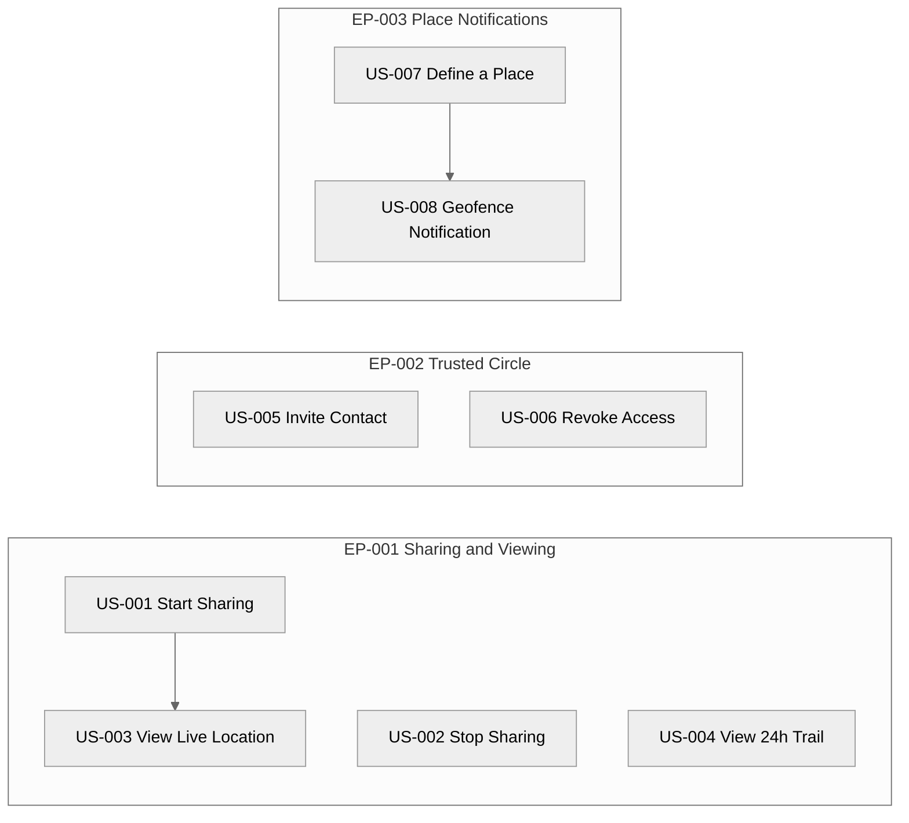

> **This is a calibration example — not a real project.**
> Use it to understand what a complete, well-formed Story set looks like after `/create-stories` has run on the matching Epic example at `examples/02-epics/` (which is in turn derived from `examples/01-elicitation/elicitation-document-example.md`).
> The project "PocketPing" and all stakeholders are fictional. **All Stories are in `Status = Pending`** — the human Product Owner would either Accept them as-is or use the Open Questions to redirect specific Stories before sprint planning.
> The three examples (`01-elicitation/`, `02-epics/`, and `03-user-stories/`) together cover the first three pipeline phases. Read them in order to see how upstream changes propagate forward.

---

# User Stories — Index — PocketPing

> **Last Updated:** 2026-05-08
>
> Auto-generated by `/create-stories` on every run from the current state of `story-*.md` files in this folder.
> Do not edit manually — manual edits will be overwritten on the next run.

---

## 1. Project Overview

- **Project:** PocketPing
- **Source Artefacts:**
  - `artifacts/01-elicitation/elicitation-document.md` (status: Approved, version: 1.3)
  - `artifacts/02-epics/` (Accepted Epics: 3; Pending: 0; Rejected: 0)
- **Total Stories:** 8
  - Pending: 8
  - Accepted: 0
  - Rejected: 0
- **Coverage:** 8 eligible Accepted FRs allocated, 0 orphans flagged in Section 4. Stories deferred (parent Epic not yet Accepted): 0 — see Section 5.

---

## 2. Story Map

---

## 3. Story List

| ID | Title | Parent Epic | Parent FR | Owner | Priority | Story Points | Status | File |
|----|-------|-------------|-----------|-------|----------|--------------|--------|------|
| US-001 | Start Location Sharing Session | EP-001 | FR-001 | SH-001 | Must Have | 5 | Pending | [story-001.md](story-001.md) |
| US-002 | Stop Location Sharing | EP-001 | FR-002 | SH-001 | Must Have | 5 | Pending | [story-002.md](story-002.md) |
| US-003 | View Contact Live Location | EP-001 | FR-003 | SH-001 | Must Have | 5 | Pending | [story-003.md](story-003.md) |
| US-004 | View 24-Hour Location Trail | EP-001 | FR-004 | SH-001 | Should Have | 5 | Pending | [story-004.md](story-004.md) |
| US-005 | Invite Contact to Trusted Circle | EP-002 | FR-005 | SH-001 | Must Have | 8 | Pending | [story-005.md](story-005.md) |
| US-006 | Revoke Contact Access | EP-002 | FR-006 | SH-003 | Must Have | 8 | Pending | [story-006.md](story-006.md) |
| US-007 | Define a Place | EP-003 | FR-007 | SH-001 | Should Have | 1 | Pending | [story-007.md](story-007.md) |
| US-008 | Geofence Notification | EP-003 | FR-008 | SH-001 | Should Have | 1 | Pending | [story-008.md](story-008.md) |

---

## 4. Coverage Matrix — Functional Requirements (eligible only)

| FR ID | Title | Parent Epic | In Story | Status |
|-------|-------|-------------|----------|--------|
| FR-001 | Start Location Sharing Session | EP-001 | US-001 | Covered |
| FR-002 | Stop Location Sharing | EP-001 | US-002 | Covered |
| FR-003 | View Contact Live Location | EP-001 | US-003 | Covered |
| FR-004 | View 24-Hour Location Trail | EP-001 | US-004 | Covered |
| FR-005 | Invite Contact to Trusted Circle | EP-002 | US-005 | Covered |
| FR-006 | Revoke Contact Access | EP-002 | US-006 | Covered |
| FR-007 | Define a Place | EP-003 | US-007 | Covered |
| FR-008 | Geofence Notification | EP-003 | US-008 | Covered |

---

## 5. Stories Deferred (parent Epic not yet Accepted)

| FR ID | Parent Epic | Epic Status | Reason for Deferral |
|-------|-------------|-------------|---------------------|
| — | — | — | All Accepted FRs in the elicit doc are linked to Accepted Epics in this run; no Stories deferred. |

---

## 6. Epic Grouping

### EP-001 — Real-Time Location Sharing & Viewing

- Owner: SH-001 | Priority: Must Have | Total Points: 20
- Stories:
  - US-001 (5 pts) — Start Location Sharing Session
  - US-002 (5 pts) — Stop Location Sharing
  - US-003 (5 pts) — View Contact Live Location
  - US-004 (5 pts) — View 24-Hour Location Trail

### EP-002 — Manage Trusted Circle

- Owner: SH-001 | Priority: Must Have | Total Points: 16
- Stories:
  - US-005 (8 pts) — Invite Contact to Trusted Circle
  - US-006 (8 pts) — Revoke Contact Access

### EP-003 — Place Notifications

- Owner: SH-001 | Priority: Should Have | Total Points: 2
- Stories:
  - US-007 (1 pt) — Define a Place
  - US-008 (1 pt) — Geofence Notification

---

## 7. Open Questions (across all Stories)

| OQ ID | Severity | Question | Affecting Story | Status |
|-------|----------|----------|-----------------|--------|
| — | — | (none raised by `/create-stories` in this run) | — | — |

> Pre-existing upstream OQs (OQ-005 on EP-001 merge, OQ-006 on EP-003 missing success metrics) remain Open in `artifacts/02-epics/` and continue to apply to the Stories generated under those Epics — see Section 8 of the affected story files.

Validation: 0 OQs added across coverage / owner / cycle / sanity checks.

---

## 8. Acceptance Status Overview

| ID | Title | Owner | Status | Accepted Date |
|----|-------|-------|--------|---------------|
| US-001 | Start Location Sharing Session | SH-001 | Pending | — |
| US-002 | Stop Location Sharing | SH-001 | Pending | — |
| US-003 | View Contact Live Location | SH-001 | Pending | — |
| US-004 | View 24-Hour Location Trail | SH-001 | Pending | — |
| US-005 | Invite Contact to Trusted Circle | SH-001 | Pending | — |
| US-006 | Revoke Contact Access | SH-003 | Pending | — |
| US-007 | Define a Place | SH-001 | Pending | — |
| US-008 | Geofence Notification | SH-001 | Pending | — |

---

## 9. Revision History

| Version | Date | Changed By | Changes |
|---------|------|-----------|---------|
| 1.0 | 2026-05-08 | create-stories skill (initial run) | Initial index — 8 Stories minted across 3 Accepted Epics, 8 eligible FRs covered, 0 OQs raised |
