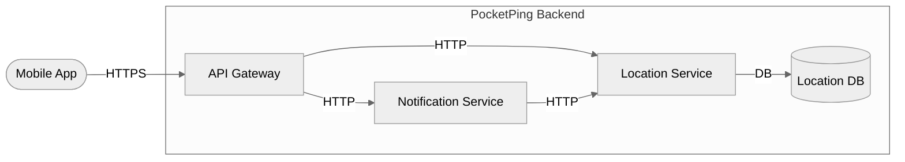

> **This is a calibration example — not a real project.**
> Use it to understand what a complete, well-formed Software Requirements Specification looks like after `/create-srs` has run on the matching upstream artefacts at `examples/01-elicitation/`, `examples/02-epics/`, and `examples/03-user-stories/`.
> The project "PocketPing" and all stakeholders are fictional. **Status is `Pending`** in this calibration set — the human reviewer would Accept it after walking the document end-to-end.

---

# Software Requirements Specification — PocketPing

> **Status:** Pending | **Version:** 1.0 | **Created:** 2026-05-08 | **Last Updated:** 2026-05-08
>
> Compiled by `/create-srs` from the Approved Elicitation Document, the Accepted Epic set, and every Accepted Story under those Epics. Lifts FRs, NFRs, CONs, ACs, and Stories verbatim from upstream — Sections 1, 2, and 9 are skill-generated. The SRS is **partial-by-Epic**: it covers exactly the Accepted Epic set; Stakeholders, BUCs, FRs and ACs whose parent Epic is Pending or Rejected are listed as `Deferred` in Section 9 rather than absent.
>
> Modelled on IEEE 29148:2018 *Systems and software engineering — Life cycle processes — Requirements engineering*.

---

## 1. Introduction

### 1.1 Purpose

This Software Requirements Specification (SRS) defines the requirements that the PocketPing delivery team and its stakeholders must satisfy for the project to be considered complete. PocketPing is a mobile application that allows users to share their real-time location with a trusted circle of contacts as a personal-safety tool: people walking home alone, meeting strangers, or travelling want a trusted contact to know where they are without broadcasting publicly or relying on fragmented workarounds (manual SMS, voice calls, third-party apps with opaque privacy practices). The SRS documents the Functional Requirements, Non-Functional Requirements, Constraints, External Interfaces, and Acceptance Criteria covering all three Accepted Epics that comprise v1 of the product, and provides the traceability backbone (Stakeholder → BUC → FR → NFR → CON → Epic → Story → AC → Test Case) on which downstream test design and verification depend.

### 1.2 Scope

**In scope:** iOS and Android mobile apps, real-time location sharing with invited contacts, location history (last 24 hours), push notifications when a trusted contact arrives at or leaves a user-defined geographic boundary.

**Out of scope:** web client, public location feeds, advertising features, social features beyond the trusted circle, third-party data sharing, location sharing with more than the explicitly invited contacts.

This SRS covers the following Accepted Epics: EP-001 (Real-Time Location Sharing & Viewing), EP-002 (Manage Trusted Circle), and EP-003 (Place Notifications). All four BUCs in the upstream elicit doc fall under one of these three Epics; therefore no Stakeholders, BUCs, FRs, NFRs, CONs, or ACs are Deferred at the time of writing. Any future BUC introduced in a Pending or Rejected Epic would appear in Section 9 as `Deferred` and be added in a future revision after Epic acceptance.

### 1.3 Definitions and Acronyms

| Term | Definition | Source |
|------|------------|--------|
| AC | Acceptance Criterion | Framework |
| APNs | Apple Push Notification service — Apple's notification delivery infrastructure for iOS devices | Inferred from elicit Section 5.4 ASMP-002; not defined inline upstream — see OQ-007 |
| ASMP | Assumption | Framework |
| BUC | Business Use Case | Framework |
| COMP | Component (architectural) | Framework |
| CON | Constraint | Framework |
| EP | Epic | Framework |
| FCM | Firebase Cloud Messaging — Google's notification delivery infrastructure for Android devices | Inferred from elicit Section 5.4 ASMP-002; not defined inline upstream — see OQ-007 |
| FR | Functional Requirement | Framework |
| GDPR | General Data Protection Regulation — EU Regulation 2016/679 on the protection of natural persons with regard to the processing of personal data | Cited in elicit Sections 5.2 (NFR-003), 5.3 (CON-002), and FR-006 Rationale |
| GPS | Global Positioning System — satellite-based geolocation system | Standard usage; appears in FR-001, FR-003 — see OQ-007 |
| IEEE 29148 | International standard for requirements engineering processes | This SRS structure |
| MoSCoW | Prioritisation method: Must / Should / Could / Won't | Framework / industry standard |
| NFR | Non-Functional Requirement | Framework |
| OQ | Open Question | Framework |
| OS | Operating System | Standard usage |
| RFC 2119 | IETF best-current-practice document defining requirement-level keywords (SHALL / SHOULD / MAY) | https://www.rfc-editor.org/rfc/rfc2119 |
| RSK | Risk | Framework |
| SEQ | Sequence diagram (architectural) | Framework |
| SH | Stakeholder | Framework |
| SMS | Short Message Service — mobile-network text messaging | Standard usage; referenced in AC-FR-005-01 |
| SRS | Software Requirements Specification | Framework |
| UI | User Interface | Standard usage |
| UX | User Experience | Standard usage |
| US | User Story | Framework |
| WCAG | Web Content Accessibility Guidelines | Cited in elicit OQ-003 (deferred) |

### 1.4 References

1. *Elicitation Document — PocketPing*, v1.3, Approved 2026-04-15 by SH-001 (Alex Chen, Product Owner). Path: `artifacts/01-elicitation/elicitation-document.md`.
2. `product-brief.md` — primary input for BUCs, FRs, scope (per elicit Source fields).
3. `stakeholder-notes.md` — primary input for SH-003, FR-005 consent requirement, NFR-003, CON-002, CON-003.
4. `technical-constraints.md` — primary input for SH-002, FR-007/FR-008, NFR-001, NFR-002, NFR-004, COMP-001, SEQ-001, SEQ-002.
5. `user-research-summary.md` — primary input for SH-004, ASMP-001, ASMP-003, NFR-004 user perspective.
6. *Epic EP-001 — Real-Time Location Sharing & Viewing*, v1.0. Path: `artifacts/02-epics/epic-001.md`.
7. *Epic EP-002 — Manage Trusted Circle*, v1.0. Path: `artifacts/02-epics/epic-002.md`.
8. *Epic EP-003 — Place Notifications*, v1.0. Path: `artifacts/02-epics/epic-003.md`.
9. *Story US-001 — Start Location Sharing Session*, v1.0. Path: `artifacts/03-user-stories/story-001.md`.
10. *Story US-002 — Stop Location Sharing*, v1.0. Path: `artifacts/03-user-stories/story-002.md`.
11. *Story US-003 — View Contact Live Location*, v1.0. Path: `artifacts/03-user-stories/story-003.md`.
12. *Story US-004 — View 24-Hour Location Trail*, v1.0. Path: `artifacts/03-user-stories/story-004.md`.
13. *Story US-005 — Invite Contact to Trusted Circle*, v1.0. Path: `artifacts/03-user-stories/story-005.md`.
14. *Story US-006 — Revoke Contact Access*, v1.0. Path: `artifacts/03-user-stories/story-006.md`.
15. *Story US-007 — Define a Place*, v1.0. Path: `artifacts/03-user-stories/story-007.md`.
16. *Story US-008 — Geofence Notification*, v1.0. Path: `artifacts/03-user-stories/story-008.md`.
17. `inputs/APIs/location-service.yaml` — OpenAPI 3.0.3 definition of the PocketPing Location Service.
18. Bradner, S. *Key words for use in RFCs to Indicate Requirement Levels.* RFC 2119, IETF, March 1997. https://www.rfc-editor.org/rfc/rfc2119
19. ISO/IEC/IEEE 29148:2018 — *Systems and software engineering — Life cycle processes — Requirements engineering*.
20. Regulation (EU) 2016/679 (General Data Protection Regulation) — Articles 5, 6, 7, 7(3), and 17 are normative inputs to NFR-003, FR-005, FR-006, and CON-002.

> Note: `inputs/manifest.md` was not present at run time, so the input documents in items 2–5 above are reconstructed from `Source` fields cited inside the Elicitation Document rather than from a manifest. See OQ-008.

### 1.5 Overview

This document is structured as follows:

- **Section 2 (Overall Description)** sets out the product's perspective, user classes, operating environment, design constraints, assumptions, and risks.
- **Section 3 (System Features)** lists each Accepted Epic with its constituent User Stories.
- **Section 4 (Functional Requirements)** specifies every Accepted FR in scope, grouped by Priority.
- **Section 5 (Non-Functional Requirements)** specifies every Accepted NFR in scope, including cross-cutting NFRs.
- **Section 6 (Constraints)** lists every Accepted Constraint binding the system.
- **Section 7 (External Interfaces)** describes every API the system exposes or consumes, derived from `inputs/APIs/`.
- **Section 8 (Acceptance Criteria)** lists every AC for FRs and NFRs in scope.
- **Section 9 (Traceability Matrix)** provides forward and backward traceability across the full chain Stakeholder → BUC → FR → NFR → CON → Epic → Story → AC → Test Case.
- **Section 10 (Revision History)** records changes to the SRS itself.

---

## 2. Overall Description

### 2.1 Product Perspective

PocketPing is delivered as a native mobile application (iOS and Android) that talks over HTTPS to a backend comprising an API Gateway, a Location Service backed by a Location DB, and a Notification Service that fans out push messages via APNs and FCM. The Location Service evaluates geofences on every location update and signals the Notification Service when a trusted contact crosses a defined Place boundary. The Mobile App is the only client; there is no web client in v1 (CON-001). The component overview from elicit Section 4.0 is reproduced below.

### 2.2 User Classes

#### End User (and proxies)

- **Stakeholder IDs:** SH-001 (Alex Chen, Product Owner — acting on behalf of the End User in every BUC narrative), SH-004 (User Research Rep, External — End User Representative)
- **Primary Concerns:** Feature scope, user experience quality, delivery timeline (SH-001); simplicity, privacy controls, notification relevance, battery life (SH-004)
- **BUCs engaged:** BUC-001 (Share Location), BUC-002 (View Contact Location), BUC-003 (Manage Trusted Circle), BUC-004 (Place Notifications) — SH-001 is the Primary Actor for all four BUCs

#### Engineering

- **Stakeholder IDs:** SH-002 (Priya Nair, Lead Mobile Engineer)
- **Primary Concerns:** Technical feasibility, battery impact of location polling, API latency
- **BUCs engaged:** BUC-001 (co-stakeholder), BUC-002 (co-stakeholder), BUC-004 (co-stakeholder)

#### Privacy & Compliance

- **Stakeholder IDs:** SH-003 (Marcus Johansson, Privacy & Compliance Officer)
- **Primary Concerns:** GDPR compliance, data minimisation, user consent flows, data retention
- **BUCs engaged:** BUC-001 (co-stakeholder), BUC-003 (co-stakeholder); accepts FR-006 (revoke) and NFR-003 (retention); owner of CON-002 (GDPR), CON-003 (no third-party analytics in core flow)

### 2.3 Operating Environment

- The system shall be delivered as native applications running on iOS and Android mobile devices. No web client, browser extension, or desktop app is in scope for v1 (CON-001).
- Target devices run iOS 16+ or Android 12+ (ASMP-001 — Validated).
- Push notifications are delivered through Apple Push Notification service (APNs) on iOS and Firebase Cloud Messaging (FCM) on Android. Both contracts are assumed stable for the 18-month delivery window (ASMP-002 — Validated).
- Performance benchmarking devices for NFR-004 (Battery Impact) are iPhone 14 and Samsung Galaxy S23 under standard lab conditions.

### 2.4 Design and Implementation Constraints

- **CON-002 (Regulatory — GDPR Applicability).** PocketPing will be available in the EU. All processing of location data — a special category of personal data under GDPR — must comply with GDPR Articles 5, 6, 7, and 17. Source: stakeholder-notes.md (SH-003). System-wide implication: every FR in Section 4 inherits this constraint, and FR-002, FR-005, FR-006, and NFR-003 implement specific GDPR obligations (consent, withdrawal of consent, retention).
- **CON-003 (Regulatory — No Third-Party Analytics in Core Flow).** Third-party analytics SDKs (Firebase Analytics, Amplitude, etc.) must not be included in the location data transmission path or store any location coordinates. Source: stakeholder-notes.md (SH-003). System-wide implication: analytics may use only anonymised event names; coordinates, place names, and contact IDs may not appear in any analytics call.

### 2.5 Assumptions and Dependencies

| ID | Description | Owner | Status | Impact if Wrong |
|----|-------------|-------|--------|-----------------|
| ASMP-001 | Target users have smartphones running iOS 16+ or Android 12+ | SH-004 | Validated | If wrong: significant share of users cannot install the app; must support older OS versions, increasing test matrix and development cost |
| ASMP-002 | The push notification infrastructure (APNs for iOS, FCM for Android) will maintain its current API contracts throughout the 18-month delivery window | SH-002 | Validated | If wrong: notification delivery will break; the geofence notification feature (BUC-004) will be inoperable until the integration is updated |
| ASMP-003 | Users in the target market have sufficient mobile data plans to support 10-second location polling without incurring unexpected data charges | SH-004 | Validated | If wrong: battery and data cost complaints will drive uninstalls; must offer configurable polling frequency |

### 2.6 Risks

| ID | Description | Likelihood | Impact | Owner | Mitigation | Status |
|----|-------------|-----------|--------|-------|-----------|--------|
| RSK-001 | iOS background location access policy changes (Apple could restrict background location in a future OS update) | L | H | SH-002 | Monitor Apple Developer release notes; design the location sharing session to gracefully degrade to foreground-only if background access is revoked; notify the sharing user when location updates have paused | Mitigated |
| RSK-002 | GDPR regulatory interpretation changes: supervisory authorities could issue new guidance that requires stricter consent mechanisms than currently planned | M | H | SH-003 | Consent flow is designed as a standalone module; reconfiguring consent screens does not require a full release; legal review checkpoint scheduled at 6-month mark | Mitigated |
| RSK-003 | Location DB performance bottleneck at scale: the write rate from 10,000 concurrent sharing sessions (1 write/10s per session = 1,000 writes/sec) may exceed single-instance PostgreSQL capacity | M | M | SH-002 | Load test at 150% of target concurrency before launch; design Location Service to support horizontal read replicas from day one; timebox investigation of write partitioning if needed | Mitigated |

---

## 3. System Features

### EP-001 — Real-Time Location Sharing & Viewing

This Epic delivers PocketPing's core value proposition: a registered user can start and stop a real-time location sharing session with one or more contacts from their trusted circle, and any contact with an active session can view the sharing user's current position on a map together with a 24-hour movement trail. It bundles the outbound side (start, stop) with the inbound side (live pin, trail) because the two BUCs are operated by the same primary actor (SH-001) and share the same end-to-end performance and authentication NFRs. **Business value:** PocketPing exists so users in personal-safety scenarios can let trusted people see where they are without broadcasting publicly or relying on manual SMS or voice check-ins (Problem Statement, elicit Section 1.2). Without this Epic the product has no function: BUC-001 delivers the "share with one tap" promise and BUC-002 delivers the recipient half of that promise.

**Stories under this Epic:**

- **US-001 — Start Location Sharing Session** (5 pts; blocks US-003)
  - *As a Product Owner (acting on behalf of the End User), I want to initiate a real-time location sharing session by selecting one or more contacts from my trusted circle, so that selected contacts can see where I am on a live map pin that updates automatically.*
  - Parent FR: FR-001 | Owner: SH-001
- **US-002 — Stop Location Sharing** (5 pts)
  - *As a Product Owner (acting on behalf of the End User), I want to stop all of my active location sharing sessions at any time, so that I can revoke sharing instantly and contacts can no longer see where I am.*
  - Parent FR: FR-002 | Owner: SH-001
- **US-003 — View Contact Live Location** (5 pts; depends on US-001)
  - *As a Product Owner (acting on behalf of the End User), I want to see the current GPS position of any trusted contact who is sharing their location, on a map with a last-updated timestamp, so that I can tell where they are and how recent the information is.*
  - Parent FR: FR-003 | Owner: SH-001
- **US-004 — View 24-Hour Location Trail** (5 pts)
  - *As a Product Owner (acting on behalf of the End User), I want to see a 24-hour movement trail for a contact I am viewing, drawn as a polyline on the map, so that I can understand the path the contact took, not just where they are right now.*
  - Parent FR: FR-004 | Owner: SH-001

### EP-002 — Manage Trusted Circle

This Epic gives a user the ability to invite contacts into their trusted circle (with explicit acceptance by the invited party) and to remove contacts from the circle at any time, immediately terminating any active sharing sessions with the removed contact. It enforces the consent surface that gates all location-sharing flows in the rest of the product. **Business value:** the trusted circle is the consent boundary for every location-sharing interaction in PocketPing. GDPR Article 7(3) requires that withdrawal of consent be as easy as giving it, which is implemented by the invite/revoke pair (FR-005, FR-006). Without this Epic the product cannot lawfully operate in the EU per CON-002.

**Stories under this Epic:**

- **US-005 — Invite Contact to Trusted Circle** (8 pts)
  - *As a Product Owner (acting on behalf of the End User), I want to invite a new contact into my trusted circle by phone number or shareable link, with the invitee explicitly accepting before any data is shared, so that I can grow my circle of contacts who may share or view location with me, with documented consent.*
  - Parent FR: FR-005 | Owner: SH-001
- **US-006 — Revoke Contact Access** (8 pts)
  - *As a Privacy & Compliance Officer (representing the user's right to withdraw consent), I want to remove any contact from a trusted circle at any time, immediately terminating any active sharing with that contact, so that consent withdrawal is as easy as giving consent — as required by GDPR Article 7(3).*
  - Parent FR: FR-006 | Owner: SH-003

### EP-003 — Place Notifications

This Epic lets a user define named geographic boundaries ("Places") and receive a push notification when a trusted contact with an active sharing session enters or exits one of those boundaries. It is the primary value-add feature beyond raw location sharing — turning continuous coordinates into actionable arrive/leave events. **Business value:** Place notifications convert PocketPing from a "look at the map when I worry" tool into a passive safety tool — a parent does not have to keep checking the map to know the child arrived home. SH-001 has flagged this as a Should-Have feature in v1; BUC-004 was accepted by SH-001 on 2026-04-10 specifically as the value-add beyond core sharing.

**Stories under this Epic:**

- **US-007 — Define a Place** (1 pt; blocks US-008)
  - *As a Product Owner (acting on behalf of the End User), I want to create a named geographic boundary ("Place") by searching for an address or dropping a pin and adjusting a radius (50 m – 5 km), so that the system has a stored boundary it can later use to send arrive/leave notifications.*
  - Parent FR: FR-007 | Owner: SH-001
- **US-008 — Geofence Notification** (1 pt; depends on US-007)
  - *As a Product Owner (acting on behalf of the End User), I want to receive a push notification within 60 seconds whenever a trusted contact with an active sharing session enters or exits a Place I have defined, so that the system delivers arrive/leave alerts within 60 seconds of the boundary crossing.*
  - Parent FR: FR-008 | Owner: SH-001

---

## 4. Functional Requirements

> Lifted verbatim from `artifacts/01-elicitation/elicitation-document.md` Section 5.1. Every FR with `Status = Accepted` linked to a BUC in an Accepted Epic is included; FRs whose parent Epic is currently Pending or Rejected are listed in Section 9 as Deferred. At time of writing, no FRs are Deferred — all four BUCs fall under one of the three Accepted Epics.

### 4.1 Must Have

#### FR-001 — Start Location Sharing Session

- **Description:** The system SHALL allow an authenticated user to initiate a real-time location sharing session by selecting one or more contacts from their trusted circle. The system SHALL begin broadcasting the user's GPS location to the selected contacts within 5 seconds of the user confirming the session.
- **Business Use Case:** BUC-001 — Share Location
- **Stakeholder:** SH-001 — Product Owner
- **Source:** product-brief.md
- **Rationale:** Core value proposition — without this, the app has no function.
- **Acceptance Criteria:** See Section 8 — AC-FR-001-01, AC-FR-001-02
- **Status:** Accepted | **Accepted By:** SH-001 | **Accepted Date:** 2026-04-10

#### FR-002 — Stop Location Sharing

- **Description:** The system SHALL allow a user to stop all active location sharing sessions at any time. All sessions SHALL be terminated within 3 seconds of the stop action. The system SHALL NOT deliver further location updates to any contact after session termination.
- **Business Use Case:** BUC-001 — Share Location
- **Stakeholder:** SH-001 — Product Owner
- **Source:** product-brief.md
- **Rationale:** Privacy control — users must be able to revoke sharing instantly.
- **Acceptance Criteria:** See Section 8 — AC-FR-002-01
- **Status:** Accepted | **Accepted By:** SH-001 | **Accepted Date:** 2026-04-10

#### FR-003 — View Contact Live Location

- **Description:** The system SHALL display the current GPS position of any trusted contact who has an active sharing session on a map, represented as a location pin with a last-updated timestamp visible to the viewing user.
- **Business Use Case:** BUC-002 — View Contact Location
- **Stakeholder:** SH-001 — Product Owner
- **Source:** product-brief.md
- **Rationale:** Complementary to FR-001 — sharing is only useful if the recipient can see the location.
- **Acceptance Criteria:** See Section 8 — AC-FR-003-01
- **Status:** Accepted | **Accepted By:** SH-001 | **Accepted Date:** 2026-04-10

#### FR-005 — Invite Contact to Trusted Circle

- **Description:** The system SHALL allow a user to invite a new contact to their trusted circle via a shareable invite link or by entering a phone number. The invited contact SHALL receive an in-app notification and SHALL explicitly accept the invitation before any location data is shared with them.
- **Business Use Case:** BUC-003 — Manage Trusted Circle
- **Stakeholder:** SH-001 — Product Owner
- **Source:** product-brief.md, stakeholder-notes.md
- **Rationale:** Explicit consent is required before location sharing can occur — regulatory and ethical requirement.
- **Acceptance Criteria:** See Section 8 — AC-FR-005-01, AC-FR-005-02
- **Status:** Accepted | **Accepted By:** SH-001 | **Accepted Date:** 2026-04-10

#### FR-006 — Revoke Contact Access

- **Description:** The system SHALL allow a user to remove any contact from their trusted circle at any time. The system SHALL immediately terminate all active location sharing sessions with the removed contact upon removal.
- **Business Use Case:** BUC-003 — Manage Trusted Circle
- **Stakeholder:** SH-003 — Privacy & Compliance Officer
- **Source:** product-brief.md
- **Rationale:** GDPR Article 7(3) — withdrawal of consent must be as easy as giving it.
- **Acceptance Criteria:** See Section 8 — AC-FR-006-01
- **Status:** Accepted | **Accepted By:** SH-003 | **Accepted Date:** 2026-04-10

### 4.2 Should Have

#### FR-004 — View 24-Hour Location Trail

- **Description:** The system SHOULD render a movement trail for a contact being viewed, displayed as a polyline on the map, covering the contact's path for the previous 24 hours.
- **Business Use Case:** BUC-002 — View Contact Location
- **Stakeholder:** SH-001 — Product Owner
- **Source:** product-brief.md
- **Rationale:** Adds context to the current location — useful for safety scenarios ("did they arrive home?").
- **Acceptance Criteria:** See Section 8 — AC-FR-004-01
- **Status:** Accepted | **Accepted By:** SH-001 | **Accepted Date:** 2026-04-10

#### FR-007 — Define a Place

- **Description:** The system SHOULD allow a user to create a named geographic boundary ("Place") by searching for an address or dropping a pin and adjusting a radius (50m–5km). The system SHALL store the Place and associate it with the user's account.
- **Business Use Case:** BUC-004 — Place Notifications
- **Stakeholder:** SH-001 — Product Owner
- **Source:** product-brief.md
- **Rationale:** Places are the foundation for geofence notifications (BUC-004).
- **Acceptance Criteria:** See Section 8 — AC-FR-007-01
- **Status:** Accepted | **Accepted By:** SH-001 | **Accepted Date:** 2026-04-10

#### FR-008 — Geofence Notification

- **Description:** The system SHOULD send the user a push notification within 60 seconds when a trusted contact with an active sharing session enters or exits a user-defined Place boundary.
- **Business Use Case:** BUC-004 — Place Notifications
- **Stakeholder:** SH-001 — Product Owner
- **Source:** product-brief.md
- **Rationale:** Primary value-add feature beyond basic location sharing.
- **Acceptance Criteria:** See Section 8 — AC-FR-008-01
- **Status:** Accepted | **Accepted By:** SH-001 | **Accepted Date:** 2026-04-10

### 4.3 Could Have / Won't Have

(none — no Accepted FR carries Could Have or Won't Have priority in the elicit doc.)

---

## 5. Non-Functional Requirements

> Lifted verbatim from elicit doc Section 5.2. Cross-cutting NFRs (those whose Business Use Case field references multiple BUCs) are listed once with the full BUC scope and Cross-cutting flag.

### NFR-001 — Location Update Latency

- **Description:** The system SHALL propagate location updates from the sharing user's device to a viewing contact's device with sufficiently low latency to maintain a sense of real-time presence. See Measurable Target for the specific threshold.
- **Category:** Performance
- **Priority:** Must Have
- **Measurable Target:** End-to-end location update latency must be < 5 seconds at p95 under 10,000 concurrent sharing sessions.
- **Business Use Case scope:** BUC-001, BUC-002
- **Cross-cutting?** Yes (spans BUC-001 and BUC-002, both within EP-001)
- **Acceptance Criteria:** See Section 8 — AC-NFR-001-01
- **Status:** Accepted | **Accepted By:** SH-002 | **Accepted Date:** 2026-04-10

### NFR-002 — Session Authentication

- **Description:** The system SHALL require valid authentication on all API endpoints. The system SHALL reject all unauthenticated requests.
- **Category:** Security
- **Priority:** Must Have
- **Measurable Target:** 100% of API endpoints return HTTP 401 for requests with no valid session token. Zero endpoints accessible without authentication in penetration test.
- **Business Use Case scope:** BUC-001, BUC-002, BUC-003
- **Cross-cutting?** Yes (spans EP-001 and EP-002; system-wide effect on every API endpoint)
- **Acceptance Criteria:** See Section 8 — AC-NFR-002-01
- **Status:** Accepted | **Accepted By:** SH-002 | **Accepted Date:** 2026-04-10

### NFR-003 — Data Retention Compliance

- **Description:** The system SHALL NOT retain location data beyond the minimum period necessary as required by GDPR Article 5(1)(e) (storage limitation principle). See Measurable Target for the specific retention window.
- **Category:** Compliance
- **Priority:** Must Have
- **Measurable Target:** All location records with a timestamp older than 30 days from the current date must be automatically deleted within 24 hours of reaching that threshold.
- **Business Use Case scope:** BUC-001
- **Cross-cutting?** No
- **Acceptance Criteria:** See Section 8 — AC-NFR-003-01
- **Status:** Accepted | **Accepted By:** SH-003 | **Accepted Date:** 2026-04-10

### NFR-004 — Battery Impact

- **Description:** The system SHOULD minimise battery consumption caused by background location polling on the user's device. See Measurable Target for the specific threshold.
- **Category:** Usability
- **Priority:** Should Have
- **Measurable Target:** Background location polling must consume < 5% of device battery per hour when actively sharing, measured on iPhone 14 and Samsung Galaxy S23 under standard lab conditions.
- **Business Use Case scope:** BUC-001
- **Cross-cutting?** No
- **Acceptance Criteria:** See Section 8 — AC-NFR-004-01
- **Status:** Accepted | **Accepted By:** SH-004 | **Accepted Date:** 2026-04-10

---

## 6. Constraints

> Lifted verbatim from elicit doc Section 5.3. CON-002 and CON-003 are also restated in Section 2.4 as Design and Implementation Constraints because of their system-wide regulatory effect; the canonical record remains here.

### CON-001 — Platform Scope

- **Description:** v1 of PocketPing is iOS and Android mobile only. No web client, browser extension, or desktop app will be built in v1.
- **Type:** Organizational
- **Impact:** All UI/UX must be designed for mobile touch interfaces. No API endpoints need to serve HTML or support browser sessions.
- **Source:** product-brief.md
- **Status:** Accepted | **Accepted By:** SH-001

### CON-002 — GDPR Applicability

- **Description:** PocketPing will be available in the EU. All processing of location data (a special category of personal data under GDPR) must comply with GDPR Articles 5, 6, 7, and 17.
- **Type:** Regulatory
- **Impact:** Location data requires explicit, informed consent (covered by FR-005). Retention must be limited (covered by NFR-003). Data subjects must be able to revoke consent (covered by FR-002, FR-006).
- **Source:** stakeholder-notes.md
- **Status:** Accepted | **Accepted By:** SH-003

### CON-003 — No Third-Party Analytics in Core Flow

- **Description:** Third-party analytics SDKs (Firebase Analytics, Amplitude, etc.) must not be included in the location data transmission path or store any location coordinates.
- **Type:** Regulatory
- **Impact:** Analytics must be implemented using only anonymised event names. No analytics call may include coordinates, place names, or contact IDs.
- **Source:** stakeholder-notes.md
- **Status:** Accepted | **Accepted By:** SH-003

---

## 7. External Interfaces

> Derived from OpenAPI 3.x YAML files in `inputs/APIs/`. Each service is summarised; full schemas remain in the YAML files referenced.

### PocketPing Location Service

- **Base URL:** `https://api.pocketping.example/v1`
- **OpenAPI Version:** 3.0.3
- **Service Version:** 1.0.0
- **Source YAML:** `inputs/APIs/location-service.yaml`

| Method | Path | operationId | Summary |
|--------|------|-------------|---------|
| POST | /sessions | startSharing | Begin a real-time location sharing session |
| DELETE | /sessions/{id} | stopSharing | End an active sharing session |
| GET | /contacts/{id}/location | getContactLocation | Retrieve a trusted contact's current location |

**Key schemas:** `SharingSession`, `LocationPoint`, `Contact`

> Note: the schemas in `components/schemas` are declared but empty in the source YAML — they are placeholders. The detailed property-level definitions need to be populated before downstream test design (`/create-tests`) can validate request/response shapes. See OQ-009.

> Note: the OpenAPI spec defines endpoints supporting BUC-001 (start/stop) and BUC-002 (read live location). It does not currently expose endpoints for trail retrieval (FR-004), trusted-circle invite/revoke (FR-005, FR-006), Place creation (FR-007), or geofence notifications (FR-008). The elicit Section 4.0 architecture implies that those flows are served by the same Location Service plus a Notification Service; their absence from the YAML may be a documentation gap or an intentional v1 scoping decision. See OQ-010.

---

## 8. Acceptance Criteria

> Lifted verbatim from elicit doc Section 6. AC IDs and acceptance fields belong to the elicit doc; the SRS inherits them for traceability.

### FR-001 Acceptance Criteria

- **AC-FR-001-01**
  - **Given:** A registered user has at least one contact in their trusted circle with the app installed
  - **When:** The user taps "Share My Location" and selects one contact, then confirms
  - **Then:** Within 5 seconds, the selected contact's app displays the sharing user's location pin on the map
  - **Status:** Accepted | **Accepted By:** SH-001 | **Accepted Date:** 2026-04-12
- **AC-FR-001-02**
  - **Given:** A registered user has initiated a sharing session with a contact
  - **When:** The sharing user's device moves 50 metres from the last recorded position
  - **Then:** The contact's app updates the location pin to the new position within 5 seconds
  - **Status:** Accepted | **Accepted By:** SH-001 | **Accepted Date:** 2026-04-12

### FR-002 Acceptance Criteria

- **AC-FR-002-01**
  - **Given:** A user has an active location sharing session with at least one contact
  - **When:** The user taps "Stop Sharing"
  - **Then:** Within 3 seconds, the contact's app stops receiving location updates and the sharing user's pin is removed from the contact's map view
  - **Status:** Accepted | **Accepted By:** SH-001 | **Accepted Date:** 2026-04-12

### FR-003 Acceptance Criteria

- **AC-FR-003-01**
  - **Given:** A contact has an active sharing session with the viewing user
  - **When:** The viewing user opens the contact's profile in the app
  - **Then:** A map is displayed showing the contact's current location pin and a timestamp indicating when the location was last updated
  - **Status:** Accepted | **Accepted By:** SH-001 | **Accepted Date:** 2026-04-12

### FR-004 Acceptance Criteria

- **AC-FR-004-01**
  - **Given:** A contact has been sharing their location for at least 1 hour
  - **When:** The viewing user selects the contact and taps "Show Trail"
  - **Then:** A polyline is drawn on the map connecting the contact's recorded positions for the previous 24 hours, from oldest to most recent
  - **Status:** Accepted | **Accepted By:** SH-001 | **Accepted Date:** 2026-04-12

### FR-005 Acceptance Criteria

> FR-005 contains two independently testable behaviours. They are split into separate ACs to comply with the single-outcome rule.

- **AC-FR-005-01**
  - **Given:** A registered user is on the "Add Contact" screen
  - **When:** The user enters a phone number and taps "Send Invite"
  - **Then:** The target phone number receives an SMS containing a unique invite link and the inviting user's display name
  - **Status:** Accepted | **Accepted By:** SH-001 | **Accepted Date:** 2026-04-12
- **AC-FR-005-02**
  - **Given:** An invited contact receives the invite link and taps "Accept"
  - **When:** The contact confirms acceptance in the app
  - **Then:** The inviting user's trusted circle is updated to include the new contact, and location sharing between the two users becomes possible
  - **Status:** Accepted | **Accepted By:** SH-001 | **Accepted Date:** 2026-04-12

### FR-006 Acceptance Criteria

- **AC-FR-006-01**
  - **Given:** A user has a contact in their trusted circle with an active location sharing session
  - **When:** The user navigates to the contact's profile and taps "Remove from Circle", then confirms
  - **Then:** All active sharing sessions between the user and the removed contact are terminated immediately; the removed contact's app can no longer display the user's location
  - **Status:** Accepted | **Accepted By:** SH-003 | **Accepted Date:** 2026-04-12

### FR-007 Acceptance Criteria

- **AC-FR-007-01**
  - **Given:** A user is on the "Add Place" screen
  - **When:** The user searches for an address, drops a pin on the result, sets a radius of 200m, enters the name "Home", and taps "Save"
  - **Then:** A Place named "Home" with a 200m radius centred on the selected address is stored in the user's account and appears in their Places list
  - **Status:** Accepted | **Accepted By:** SH-001 | **Accepted Date:** 2026-04-12

### FR-008 Acceptance Criteria

- **AC-FR-008-01**
  - **Given:** A user has defined a Place with a 300m radius, and a trusted contact has an active sharing session
  - **When:** The contact's location crosses the 300m boundary (entering or exiting)
  - **Then:** The user receives a push notification within 60 seconds of the boundary crossing, containing the contact's display name, the Place name, and whether they arrived or left
  - **Status:** Accepted | **Accepted By:** SH-001 | **Accepted Date:** 2026-04-12

### NFR-001 Acceptance Criteria

- **AC-NFR-001-01**
  - **Criterion:** End-to-end location update latency must be < 5 seconds at p95 under 10,000 concurrent sharing sessions.
  - **Status:** Accepted | **Accepted By:** SH-002 | **Accepted Date:** 2026-04-12

### NFR-002 Acceptance Criteria

- **AC-NFR-002-01**
  - **Criterion:** 100% of API endpoints return HTTP 401 for requests with no valid session token. Zero endpoints accessible without authentication in penetration test.
  - **Status:** Accepted | **Accepted By:** SH-002 | **Accepted Date:** 2026-04-12

### NFR-003 Acceptance Criteria

- **AC-NFR-003-01**
  - **Criterion:** All location records with a timestamp older than 30 days from the current date must be automatically deleted within 24 hours of reaching that threshold.
  - **Status:** Accepted | **Accepted By:** SH-003 | **Accepted Date:** 2026-04-12

### NFR-004 Acceptance Criteria

- **AC-NFR-004-01**
  - **Criterion:** Background location polling must consume < 5% of device battery per hour when actively sharing, measured on iPhone 14 and Samsung Galaxy S23 under standard lab conditions.
  - **Status:** Accepted | **Accepted By:** SH-004 | **Accepted Date:** 2026-04-12

---

## 9. Traceability Matrix

> Auto-generated by `/create-srs` on every run. Always rebuilt from current upstream state — do not edit manually. CON column shows the system-wide constraints that apply (CON-001 binds every FR via platform scope; CON-002 binds every FR that processes location data; CON-003 binds every FR/NFR in the location data path). Test Case column is reserved for `/create-tests` (Phase 5).

| Stakeholder | BUC | FR | NFR | CON | Epic | Story | AC | Test Case |
|-------------|-----|-----|-----|-----|------|-------|-----|----------|
| SH-001 | BUC-001 | FR-001 | NFR-001, NFR-002, NFR-003, NFR-004 | CON-001, CON-002, CON-003 | EP-001 | US-001 | AC-FR-001-01 | — |
| SH-001 | BUC-001 | FR-001 | NFR-001, NFR-002, NFR-003, NFR-004 | CON-001, CON-002, CON-003 | EP-001 | US-001 | AC-FR-001-02 | — |
| SH-001 | BUC-001 | FR-002 | NFR-002, NFR-003 | CON-001, CON-002, CON-003 | EP-001 | US-002 | AC-FR-002-01 | — |
| SH-001 | BUC-002 | FR-003 | NFR-001, NFR-002 | CON-001, CON-002, CON-003 | EP-001 | US-003 | AC-FR-003-01 | — |
| SH-001 | BUC-002 | FR-004 | NFR-002, NFR-003 | CON-001, CON-002, CON-003 | EP-001 | US-004 | AC-FR-004-01 | — |
| SH-001 | BUC-003 | FR-005 | NFR-002 | CON-001, CON-002, CON-003 | EP-002 | US-005 | AC-FR-005-01 | — |
| SH-001 | BUC-003 | FR-005 | NFR-002 | CON-001, CON-002, CON-003 | EP-002 | US-005 | AC-FR-005-02 | — |
| SH-003 | BUC-003 | FR-006 | NFR-002 | CON-001, CON-002, CON-003 | EP-002 | US-006 | AC-FR-006-01 | — |
| SH-001 | BUC-004 | FR-007 | (none direct; NFR-002 cross-cutting at system level) | CON-001, CON-002, CON-003 | EP-003 | US-007 | AC-FR-007-01 | — |
| SH-001 | BUC-004 | FR-008 | (none direct; NFR-002 cross-cutting at system level) | CON-001, CON-002, CON-003 | EP-003 | US-008 | AC-FR-008-01 | — |
| SH-002 | BUC-001, BUC-002 | (drives) FR-001, FR-002, FR-003, FR-004 | NFR-001 | CON-001, CON-002, CON-003 | EP-001 | US-001..US-004 | AC-NFR-001-01 | — |
| SH-002 | BUC-001, BUC-002, BUC-003 | (drives) FR-001..FR-006 | NFR-002 | CON-001, CON-002, CON-003 | EP-001, EP-002 | US-001..US-006 | AC-NFR-002-01 | — |
| SH-003 | BUC-001 | (drives) FR-002, FR-006 | NFR-003 | CON-002, CON-003 | EP-001 | US-002 (retention applies) | AC-NFR-003-01 | — |
| SH-004 | BUC-001 | (drives) FR-001 | NFR-004 | CON-001 | EP-001 | US-001 (battery applies) | AC-NFR-004-01 | — |

### 9.1 Coverage Statistics

| Element | In this SRS | Deferred (parent Epic Pending/Rejected) |
|---------|-------------|----------------------------------------|
| Stakeholders | 4 (SH-001..SH-004) | 0 |
| Business Use Cases | 4 (BUC-001..BUC-004) | 0 |
| Functional Requirements | 8 (FR-001..FR-008) | 0 |
| Non-Functional Requirements | 4 (NFR-001..NFR-004) | 0 |
| Constraints | 3 (CON-001..CON-003) | 0 |
| Epics | 3 (EP-001..EP-003) | 0 |
| Stories | 8 (US-001..US-008) | 0 |
| Acceptance Criteria | 14 (10 FR ACs + 4 NFR ACs) | 0 |

### 9.2 Orphan Checks

| Check | Result |
|-------|--------|
| Every eligible FR has at least one AC | Yes — FR-001 (2), FR-002 (1), FR-003 (1), FR-004 (1), FR-005 (2), FR-006 (1), FR-007 (1), FR-008 (1) |
| Every eligible NFR has at least one AC | Yes — NFR-001 (1), NFR-002 (1), NFR-003 (1), NFR-004 (1) |
| Every Story has a parent FR in scope | Yes — US-001→FR-001, US-002→FR-002, US-003→FR-003, US-004→FR-004, US-005→FR-005, US-006→FR-006, US-007→FR-007, US-008→FR-008 |
| Every Epic has at least one Story | Yes — EP-001 (4 Stories), EP-002 (2 Stories), EP-003 (2 Stories) |
| Every Stakeholder owns at least one BUC | Yes — SH-001 owns all four BUCs as Primary Actor; SH-002 is co-stakeholder of BUC-001/002/004; SH-003 is co-stakeholder of BUC-001/003 and accepted FR-006/CON-002/CON-003/NFR-003; SH-004 is end-user representative referenced via NFR-004 and ASMP-001/003 |

---

## 10. Revision History

| Version | Date | Changed By | Changes |
|---------|------|-----------|---------|
| 1.0 | 2026-05-08 | create-srs skill (initial run) | Initial SRS — 8 FRs, 4 NFRs, 3 CONs, 8 Stories across 3 Epics, 14 ACs. External Interfaces section populated from `inputs/APIs/location-service.yaml`. Validation: 4 OQs added (OQ-007 acronym definitions; OQ-008 missing manifest.md; OQ-009 empty OpenAPI schemas; OQ-010 OpenAPI surface narrower than FR set). No coverage gaps; no orphans. |

---

## 11. Open Questions raised by `/create-srs`

> The OQ-### namespace is shared across the elicit doc, every Epic file, every Story file, and this SRS. Highest pre-existing OQ before this run: OQ-006. New OQs continue from OQ-007.

| ID | Question | Severity | Status | Source |
|----|----------|----------|--------|--------|
| OQ-007 | The acronyms APNs (Apple Push Notification service), FCM (Firebase Cloud Messaging), and GPS (Global Positioning System) appear in the upstream artefacts (ASMP-002; FR-001 / FR-003 Description) but are not defined inline. Section 1.3 of this SRS provides a working definition; please confirm or provide the canonical PocketPing wording, then promote to elicit Section 1.3. | Medium | Open | create-srs skill |
| OQ-008 | `inputs/manifest.md` is not present at SRS compile time. The Reference list in Section 1.4 was reconstructed from the `Source` fields cited inside the Elicitation Document. Confirm that this reconstruction matches the actual input set processed by `/elicit`, or add an authoritative `inputs/manifest.md` and re-run. | Medium | Open | create-srs skill |
| OQ-009 | The OpenAPI YAML at `inputs/APIs/location-service.yaml` declares `SharingSession`, `LocationPoint`, and `Contact` schemas as empty objects `{}`. The detailed property-level definitions are required before `/create-tests` can validate request/response shapes for FR-001, FR-002, and FR-003. Add the schema bodies (fields, types, required-flags) before SRS APPROVED, or accept that the External Interfaces section is provisional. | High | Open | create-srs skill |
| OQ-010 | The OpenAPI YAML covers BUC-001 (start/stop sharing) and BUC-002 (read contact location) but exposes no endpoints for FR-004 (24-hour trail), FR-005 (invite contact), FR-006 (revoke contact), FR-007 (define a Place), or FR-008 (geofence notification). Either extend the YAML to cover those FRs, or confirm that they are served by other (currently undocumented) services and add their OpenAPI files to `inputs/APIs/`. | High | Open | create-srs skill |
