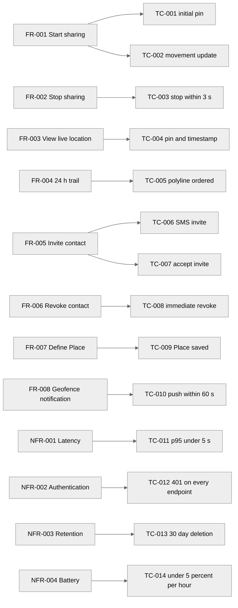

> **Calibration example — not a real project.** Produced by `/create-tests` from `examples/04-srs/srs.md`. **Status is `Pending`** — the human QA lead would Accept after review.

---

# Test Cases — Index — PocketPing

> **Last Updated:** 2026-05-08
>
> Auto-generated by `/create-tests` on every run from the current state of `test-case-*.md` files in this folder. Do not edit manually — manual edits will be overwritten on the next run.

---

## 1. Project Overview

- **Project:** PocketPing
- **Source Artefacts:**
  - `artifacts/04-srs/srs.md` (status: Accepted, version: v1.0, Approved 2026-05-08)
  - Cross-checked against `artifacts/01-elicitation/elicitation-document.md` Section 6
- **Total ACs in SRS canonical list:** 14 (10 FR ACs + 4 NFR ACs)
- **Total Test Cases:** 14
  - Pending: 14
  - Accepted: 0
  - Rejected: 0
- **Coverage:** 14 ACs covered, 0 orphans, 0 drift OQs raised against the elicit doc.

---

## 2. Test Map

---

## 3. Test Case List

| TC ID | Title | Parent AC | Parent FR/NFR | Owner | Priority | Type | Level | Status | File |
|-------|-------|-----------|---------------|-------|----------|------|-------|--------|------|
| TC-001 | Test Start Location Sharing Session — contact's app displays sharing user's pin within 5 s | AC-FR-001-01 | FR-001 | SH-001 | Must Have | Functional | Acceptance | Pending | [test-case-001.md](test-case-001.md) |
| TC-002 | Test Start Location Sharing Session — pin updates within 5 s after 50 m movement | AC-FR-001-02 | FR-001 | SH-001 | Must Have | Functional | Acceptance | Pending | [test-case-002.md](test-case-002.md) |
| TC-003 | Test Stop Location Sharing — contact stops receiving updates within 3 s and pin is removed | AC-FR-002-01 | FR-002 | SH-001 | Must Have | Functional | Acceptance | Pending | [test-case-003.md](test-case-003.md) |
| TC-004 | Test View Contact Live Location — map shows current pin and last-updated timestamp | AC-FR-003-01 | FR-003 | SH-001 | Must Have | Functional | Acceptance | Pending | [test-case-004.md](test-case-004.md) |
| TC-005 | Test View 24-Hour Location Trail — polyline drawn from oldest to most recent | AC-FR-004-01 | FR-004 | SH-001 | Should Have | Functional | Acceptance | Pending | [test-case-005.md](test-case-005.md) |
| TC-006 | Test Invite Contact to Trusted Circle — SMS delivered with invite link and inviter's name | AC-FR-005-01 | FR-005 | SH-001 | Must Have | Functional | Acceptance | Pending | [test-case-006.md](test-case-006.md) |
| TC-007 | Test Invite Contact to Trusted Circle — accepted invite adds contact and enables sharing | AC-FR-005-02 | FR-005 | SH-001 | Must Have | Functional | Acceptance | Pending | [test-case-007.md](test-case-007.md) |
| TC-008 | Test Revoke Contact Access — removing contact terminates all active sharing immediately | AC-FR-006-01 | FR-006 | SH-003 | Must Have | Functional | Acceptance | Pending | [test-case-008.md](test-case-008.md) |
| TC-009 | Test Define a Place — saved Place appears with correct name and 200 m radius | AC-FR-007-01 | FR-007 | SH-001 | Should Have | Functional | Acceptance | Pending | [test-case-009.md](test-case-009.md) |
| TC-010 | Test Geofence Notification — push received within 60 s of boundary crossing | AC-FR-008-01 | FR-008 | SH-001 | Should Have | Functional | Acceptance | Pending | [test-case-010.md](test-case-010.md) |
| TC-011 | Test Location Update Latency — p95 < 5 s under 10 000 concurrent sharing sessions | AC-NFR-001-01 | NFR-001 | SH-002 | Must Have | Performance | System | Pending | [test-case-011.md](test-case-011.md) |
| TC-012 | Test Session Authentication — every API endpoint rejects unauthenticated requests with HTTP 401 | AC-NFR-002-01 | NFR-002 | SH-002 | Must Have | Security | System | Pending | [test-case-012.md](test-case-012.md) |
| TC-013 | Test Data Retention Compliance — location records older than 30 days deleted within 24 h | AC-NFR-003-01 | NFR-003 | SH-003 | Must Have | Compliance | System | Pending | [test-case-013.md](test-case-013.md) |
| TC-014 | Test Battery Impact — background polling consumes < 5 % battery per hour while sharing | AC-NFR-004-01 | NFR-004 | SH-004 | Should Have | Usability | System | Pending | [test-case-014.md](test-case-014.md) |

---

## 4. AC Coverage Matrix

| AC ID | Parent FR/NFR | TC ID | Status |
|-------|---------------|-------|--------|
| AC-FR-001-01 | FR-001 | TC-001 | Covered |
| AC-FR-001-02 | FR-001 | TC-002 | Covered |
| AC-FR-002-01 | FR-002 | TC-003 | Covered |
| AC-FR-003-01 | FR-003 | TC-004 | Covered |
| AC-FR-004-01 | FR-004 | TC-005 | Covered |
| AC-FR-005-01 | FR-005 | TC-006 | Covered |
| AC-FR-005-02 | FR-005 | TC-007 | Covered |
| AC-FR-006-01 | FR-006 | TC-008 | Covered |
| AC-FR-007-01 | FR-007 | TC-009 | Covered |
| AC-FR-008-01 | FR-008 | TC-010 | Covered |
| AC-NFR-001-01 | NFR-001 | TC-011 | Covered |
| AC-NFR-002-01 | NFR-002 | TC-012 | Covered |
| AC-NFR-003-01 | NFR-003 | TC-013 | Covered |
| AC-NFR-004-01 | NFR-004 | TC-014 | Covered |

---

## 5. Type / Level Distribution

| Type | Count | Levels |
|------|-------|--------|
| Functional | 10 | Acceptance: 10, Integration: 0, Unit: 0 |
| Performance | 1 | System: 1 |
| Security | 1 | System: 1 |
| Usability | 1 | System: 1 |
| Reliability | 0 | System: 0 |
| Compliance | 1 | System: 1 |

---

## 6. FR / NFR Coverage Summary

| FR/NFR ID | Title | Priority | TC count | Levels covered |
|-----------|-------|----------|----------|----------------|
| FR-001 | Start Location Sharing Session | Must Have | 2 | Acceptance |
| FR-002 | Stop Location Sharing | Must Have | 1 | Acceptance |
| FR-003 | View Contact Live Location | Must Have | 1 | Acceptance |
| FR-004 | View 24-Hour Location Trail | Should Have | 1 | Acceptance |
| FR-005 | Invite Contact to Trusted Circle | Must Have | 2 | Acceptance |
| FR-006 | Revoke Contact Access | Must Have | 1 | Acceptance |
| FR-007 | Define a Place | Should Have | 1 | Acceptance |
| FR-008 | Geofence Notification | Should Have | 1 | Acceptance |
| NFR-001 | Location Update Latency | Must Have | 1 | System |
| NFR-002 | Session Authentication | Must Have | 1 | System |
| NFR-003 | Data Retention Compliance | Must Have | 1 | System |
| NFR-004 | Battery Impact | Should Have | 1 | System |

---

## 7. Open Questions (across all Test Cases)

| OQ ID | Severity | Question | Affecting TC / AC | Status |
|-------|----------|----------|-------------------|--------|
| OQ-011 | High | The authoritative API surface for the AC-NFR-002-01 enumeration is not fully captured by `inputs/APIs/location-service.yaml` — SRS OQ-009 / OQ-010 flag empty schemas and missing endpoints for FR-004..FR-008. Confirm the canonical endpoint list TC-012 will assert 401 against (e.g., extend the OpenAPI specs, or document the full Notification Service / Trusted-Circle Service surfaces) before TC-012 can be considered an exhaustive system-level test. | TC-012 | Open |

---

## 8. Acceptance Status Overview

| TC ID | Title | Owner | Status | Accepted Date |
|-------|-------|-------|--------|---------------|
| TC-001 | Test Start Location Sharing Session — contact's app displays sharing user's pin within 5 s | SH-001 | Pending | — |
| TC-002 | Test Start Location Sharing Session — pin updates within 5 s after 50 m movement | SH-001 | Pending | — |
| TC-003 | Test Stop Location Sharing — contact stops receiving updates within 3 s and pin is removed | SH-001 | Pending | — |
| TC-004 | Test View Contact Live Location — map shows current pin and last-updated timestamp | SH-001 | Pending | — |
| TC-005 | Test View 24-Hour Location Trail — polyline drawn from oldest to most recent | SH-001 | Pending | — |
| TC-006 | Test Invite Contact to Trusted Circle — SMS delivered with invite link and inviter's name | SH-001 | Pending | — |
| TC-007 | Test Invite Contact to Trusted Circle — accepted invite adds contact and enables sharing | SH-001 | Pending | — |
| TC-008 | Test Revoke Contact Access — removing contact terminates all active sharing immediately | SH-003 | Pending | — |
| TC-009 | Test Define a Place — saved Place appears with correct name and 200 m radius | SH-001 | Pending | — |
| TC-010 | Test Geofence Notification — push received within 60 s of boundary crossing | SH-001 | Pending | — |
| TC-011 | Test Location Update Latency — p95 < 5 s under 10 000 concurrent sharing sessions | SH-002 | Pending | — |
| TC-012 | Test Session Authentication — every API endpoint rejects unauthenticated requests with HTTP 401 | SH-002 | Pending | — |
| TC-013 | Test Data Retention Compliance — location records older than 30 days deleted within 24 h | SH-003 | Pending | — |
| TC-014 | Test Battery Impact — background polling consumes < 5 % battery per hour while sharing | SH-004 | Pending | — |

---

## 9. Revision History

Validation: 1 OQ added across coverage / owner / drift checks (OQ-011, High — propagated from SRS OQ-009 / OQ-010 to flag the API-surface gap that affects TC-012's enumeration completeness). 0 orphan ACs, 0 duplicate-parent-ac TCs, 0 owner gaps, 0 Type/Level gaps, 0 drift OQs against the elicit doc.

| Version | Date | Changed By | Changes |
|---------|------|-----------|---------|
| 1.0 | 2026-05-08 | create-tests skill (initial run) | Initial index — 14 TCs minted across 8 FRs and 4 NFRs, 0 drift OQs raised, 0 orphan OQs raised, 1 advisory OQ (OQ-011) raised against TC-012 due to incomplete API surface. |
