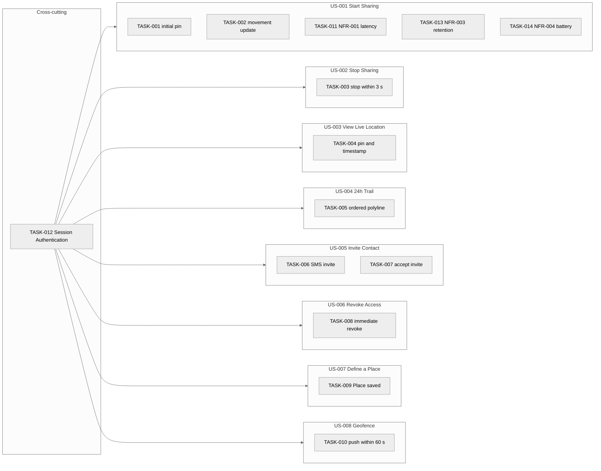

> **Calibration example — not a real project.** Produced by `/create-tasks` from `examples/04-srs/srs.md`, the eight Accepted Stories in `examples/03-user-stories/`, and the fourteen Test Cases in `examples/05-test-concept/`. **Tasks are in `Status = Pending`** — the human delivery lead would Accept after review. Use this set to understand what a complete Phase-7 handoff artefact looks like.

---

# Implementation Tasks — Index — PocketPing

> **Last Updated:** 2026-05-15
>
> Auto-generated by `/create-tasks` on every run from the current state of `task-*.md` files in this folder. Do not edit manually — manual edits will be overwritten on the next run.

---

## 1. Project Overview

- **Project:** PocketPing
- **Source Artefacts:**
  - `artifacts/04-srs/srs.md` (status: Accepted, version: v1.0, Approved 2026-05-08)
  - `artifacts/03-user-stories/` (Accepted Story subset: 8 of 8)
  - `artifacts/05-test-concept/` (14 Test Cases linked into Tasks via `parent-tcs`)
- **Total Stories in Accepted subset:** 8
- **Total Stories Deferred (Pending or parent Epic not yet Accepted):** 0
- **Total Tasks:** 14
  - Pending: 14
  - Accepted: 0
  - Rejected: 0
  - Cross-cutting: 1
- **Coverage:** 8 Stories covered, 0 orphans (Accepted Story with no Task), 0 AC-orphans.

---

## 2. Task Map

---

## 3. Task List

| TASK ID | Title | Parent Story | Parent ACs | Parent TCs | Owner | Priority | Effort | Cross-cutting | Status | File |
|---------|-------|--------------|------------|------------|-------|----------|--------|----------------|--------|------|
| TASK-001 | Implement Start Location Sharing — initial pin within 5 s | US-001 | AC-FR-001-01 | TC-001 | SH-001 | Must Have | S | No | Pending | [task-001.md](task-001.md) |
| TASK-002 | Implement Start Location Sharing — movement update within 5 s | US-001 | AC-FR-001-02 | TC-002 | SH-001 | Must Have | S | No | Pending | [task-002.md](task-002.md) |
| TASK-003 | Implement Stop Location Sharing — stop within 3 s | US-002 | AC-FR-002-01 | TC-003 | SH-001 | Must Have | S | No | Pending | [task-003.md](task-003.md) |
| TASK-004 | Implement View Contact Live Location — pin + timestamp | US-003 | AC-FR-003-01 | TC-004 | SH-001 | Must Have | S | No | Pending | [task-004.md](task-004.md) |
| TASK-005 | Implement 24-Hour Trail — ordered polyline | US-004 | AC-FR-004-01 | TC-005 | SH-001 | Should Have | S | No | Pending | [task-005.md](task-005.md) |
| TASK-006 | Implement Invite Contact — SMS delivered with link and name | US-005 | AC-FR-005-01 | TC-006 | SH-001 | Must Have | M | No | Pending | [task-006.md](task-006.md) |
| TASK-007 | Implement Accept Invite — adds contact and enables sharing | US-005 | AC-FR-005-02 | TC-007 | SH-001 | Must Have | S | No | Pending | [task-007.md](task-007.md) |
| TASK-008 | Implement Revoke Contact Access — immediate termination | US-006 | AC-FR-006-01 | TC-008 | SH-003 | Must Have | M | No | Pending | [task-008.md](task-008.md) |
| TASK-009 | Implement Define a Place — saved with name and 200 m radius | US-007 | AC-FR-007-01 | TC-009 | SH-001 | Should Have | S | No | Pending | [task-009.md](task-009.md) |
| TASK-010 | Implement Geofence Notification — push within 60 s | US-008 | AC-FR-008-01 | TC-010 | SH-001 | Should Have | S | No | Pending | [task-010.md](task-010.md) |
| TASK-011 | Verify NFR-001 — p95 latency under 5 s @ 10 000 sessions | US-001 | AC-NFR-001-01 | TC-011 | SH-002 | Must Have | M | No | Pending | [task-011.md](task-011.md) |
| TASK-012 | Cross-cutting Session Authentication — reject unauthenticated | US-001 (+US-002..US-008) | AC-NFR-002-01 | TC-012 | SH-002 | Must Have | L | Yes | Pending | [task-012.md](task-012.md) |
| TASK-013 | Verify NFR-003 — 30-day retention deleted within 24 h | US-001 | AC-NFR-003-01 | TC-013 | SH-003 | Must Have | M | No | Pending | [task-013.md](task-013.md) |
| TASK-014 | Verify NFR-004 — background polling < 5 %/hr battery | US-001 | AC-NFR-004-01 | TC-014 | SH-004 | Should Have | M | No | Pending | [task-014.md](task-014.md) |

---

## 4. Story Coverage Matrix

| Story ID | Story title | AC count | Task count | Status | Notes |
|----------|------------|----------|------------|--------|-------|
| US-001 | Start Location Sharing Session | 2 | 5 | Covered | TASK-001/-002 (base) + TASK-011/-013/-014 (NFR anchors) + TASK-012 (cross-cutting) |
| US-002 | Stop Location Sharing | 1 | 1 | Covered | + TASK-012 cross-cutting |
| US-003 | View Contact Live Location | 1 | 1 | Covered | + TASK-012 cross-cutting |
| US-004 | View 24-Hour Location Trail | 1 | 1 | Covered | + TASK-012 cross-cutting |
| US-005 | Invite Contact to Trusted Circle | 2 | 2 | Covered | + TASK-012 cross-cutting |
| US-006 | Revoke Contact Access | 1 | 1 | Covered | + TASK-012 cross-cutting |
| US-007 | Define a Place | 1 | 1 | Covered | + TASK-012 cross-cutting |
| US-008 | Geofence Notification | 1 | 1 | Covered | + TASK-012 cross-cutting |

---

## 5. AC Coverage Matrix

| AC ID | Parent Story | Parent FR/NFR | Task(s) | Status |
|-------|--------------|---------------|---------|--------|
| AC-FR-001-01 | US-001 | FR-001 | TASK-001 | Covered |
| AC-FR-001-02 | US-001 | FR-001 | TASK-002 | Covered |
| AC-FR-002-01 | US-002 | FR-002 | TASK-003 | Covered |
| AC-FR-003-01 | US-003 | FR-003 | TASK-004 | Covered |
| AC-FR-004-01 | US-004 | FR-004 | TASK-005 | Covered |
| AC-FR-005-01 | US-005 | FR-005 | TASK-006 | Covered |
| AC-FR-005-02 | US-005 | FR-005 | TASK-007 | Covered |
| AC-FR-006-01 | US-006 | FR-006 | TASK-008 | Covered |
| AC-FR-007-01 | US-007 | FR-007 | TASK-009 | Covered |
| AC-FR-008-01 | US-008 | FR-008 | TASK-010 | Covered |
| AC-NFR-001-01 | US-001 (anchor) | NFR-001 | TASK-011 | Covered |
| AC-NFR-002-01 | US-001..US-008 (cross-cutting) | NFR-002 | TASK-012 | Covered |
| AC-NFR-003-01 | US-001 (anchor) | NFR-003 | TASK-013 | Covered |
| AC-NFR-004-01 | US-001 (anchor) | NFR-004 | TASK-014 | Covered |

---

## 6. Effort Distribution (AI provisional)

| Effort | Count | Notes |
|--------|-------|-------|
| S | 8 | TASK-001..-005, TASK-007, TASK-009, TASK-010 — single AC, no per-Task NFR threshold |
| M | 5 | TASK-006 (SMS), TASK-008 (multi-session revoke), TASK-011/-013/-014 (NFR threshold) |
| L | 1 | TASK-012 (cross-cutting NFR-002 across all 8 Stories) |

---

## 7. Cross-Cutting Tasks

| TASK ID | Title | Linked Stories | Origin NFR | Effort |
|---------|-------|----------------|------------|--------|
| TASK-012 | Cross-cutting Session Authentication — reject unauthenticated | US-001, US-002, US-003, US-004, US-005, US-006, US-007, US-008 | NFR-002 (Session Authentication) | L |

---

## 8. Open Questions (across all Tasks)

| OQ ID | Severity | Question | Affecting TASK / Story / AC | Status |
|-------|----------|----------|-----------------------------|--------|
| OQ-011 | High | The authoritative API surface for AC-NFR-002-01 is not fully captured in SRS — see SRS OQ-009 / OQ-010. The cross-cutting contract is clear in intent but the enumeration of surfaces TC-012 will assert against is incomplete. | TASK-012 / AC-NFR-002-01 | Open (propagated from /create-tests) |

---

## 9. Boundary Audit Summary

- **Tasks scanned:** 14
- **Tasks flagged:** 0
- **Result:** Boundary audit clean — no codebase-specific content detected in any Task.

---

## 10. Acceptance Status Overview

| TASK ID | Title | Owner | Status | Accepted Date |
|---------|-------|-------|--------|---------------|
| TASK-001 | Implement Start Location Sharing — initial pin within 5 s | SH-001 | Pending | — |
| TASK-002 | Implement Start Location Sharing — movement update within 5 s | SH-001 | Pending | — |
| TASK-003 | Implement Stop Location Sharing — stop within 3 s | SH-001 | Pending | — |
| TASK-004 | Implement View Contact Live Location — pin + timestamp | SH-001 | Pending | — |
| TASK-005 | Implement 24-Hour Trail — ordered polyline | SH-001 | Pending | — |
| TASK-006 | Implement Invite Contact — SMS delivered with link and name | SH-001 | Pending | — |
| TASK-007 | Implement Accept Invite — adds contact and enables sharing | SH-001 | Pending | — |
| TASK-008 | Implement Revoke Contact Access — immediate termination | SH-003 | Pending | — |
| TASK-009 | Implement Define a Place — saved with name and 200 m radius | SH-001 | Pending | — |
| TASK-010 | Implement Geofence Notification — push within 60 s | SH-001 | Pending | — |
| TASK-011 | Verify NFR-001 — p95 latency under 5 s @ 10 000 sessions | SH-002 | Pending | — |
| TASK-012 | Cross-cutting Session Authentication — reject unauthenticated | SH-002 | Pending | — |
| TASK-013 | Verify NFR-003 — 30-day retention deleted within 24 h | SH-003 | Pending | — |
| TASK-014 | Verify NFR-004 — background polling < 5 %/hr battery | SH-004 | Pending | — |

---

## 11. Revision History

Validation: 1 OQ propagated (OQ-011 from /create-tests, High — affects TASK-012). 0 orphan Stories, 0 orphan ACs, 0 duplicate `(parent-story, parent-acs)` Tasks, 0 owner gaps, 0 TC-linkage gaps, 0 DoD-seed gaps, 0 boundary-audit hits.

| Version | Date | Changed By | Changes |
|---------|------|-----------|---------|
| 1.0 | 2026-05-15 | create-tasks skill (initial run) | Initial index — 14 Tasks minted across 8 Accepted Stories (10 base + 3 NFR-threshold + 1 cross-cutting), 0 orphan OQs raised, 1 propagated OQ from /create-tests (OQ-011 affecting TASK-012), 0 boundary-audit flags. |
