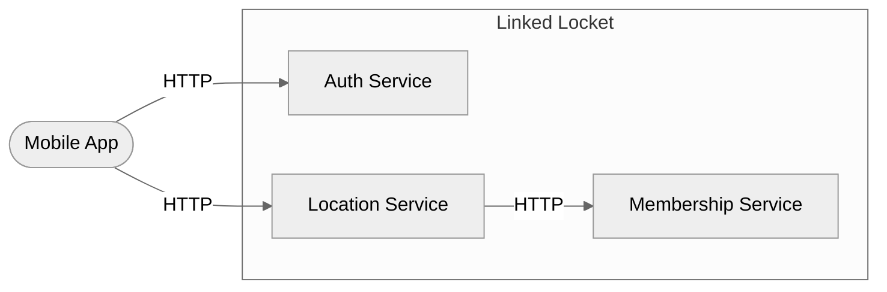

# Skill: arch-diagrams

**Purpose:** Read API definitions from `inputs/APIs/` and generate Section 4 (System Architecture Overview) in the Elicitation Document — Component diagram and Sequence diagrams.

**Invocation:**
- Claude Code: `/arch-diagrams`
- GitHub Copilot: "Run the arch-diagrams skill" or "Follow `skills/arch-diagrams/skill.md`"

**Inputs:** All YAML files in `inputs/APIs/`
**Output:** Section 4 added or updated in `artifacts/01-elicitation/elicitation-document.md`

**When to run:** After `/elicit` has produced the Elicitation Document. Re-run whenever API specs change.

---

## Step 1 — Read inputs

1. Read the full file `artifacts/01-elicitation/elicitation-document.md`.
2. Read every file in `inputs/APIs/`. For each OpenAPI 3.x YAML file (`openapi:` key present), extract:
   - **Service name** — from `info.title`
   - **Endpoints** — path + HTTP method + `operationId` for each operation
   - **External dependencies** — any server URLs pointing to other services
   - **Key request/response types** — top-level schema names from `components/schemas`

---

## Step 2 — Prepare the document

Check the document for the heading `## 4. System Architecture Overview`.

**If the heading is NOT present:**
- Change `## 4.` → `## 5.`
- Change `## 5.` → `## 6.`
- Change `## 6.` → `## 7.`
- Change `## 7.` → `## 8.`
- Change `## 8.` → `## 9.`
- Change `## 9.` → `## 10.`
- Update any text in the document that references these section numbers (e.g. "See Section 4 —" → "See Section 5 —", "Section 6 (Open Questions)" → "Section 7 (Open Questions)").
- Find the last line of Section 3 (the line before the old `## 4.`, now `## 5.`) and insert the new section there.

**If the heading IS present:** skip to Step 3 and update the existing content.

---

## Step 3 — Write Section 4.0 Component Overview

Generate a Mermaid `flowchart LR` diagram showing all services and their relationships.

Rules:
- Each service from the API YAML files = one rectangular node inside `subgraph SYS["<project name>"]`
- External clients or mobile apps = stadium-shape nodes `([...])` outside the subgraph
- If one service calls another (visible from server URLs or operationId naming): draw an arrow between them, labeled with the HTTP method or protocol
- Keep node labels short (service name only, 2–4 words)

Example structure:

After the diagram, add:
- **Source:** `inputs/APIs/<filename(s)>`
- **Status:** Pending
- **Accepted By:** `<!-- SH-xxx —- tech lead or most relevant stakeholder -->`
- **Accepted Date:** —

---

## Step 4 — Write Sequence Diagrams (one per service or major BUC)

For each service, generate one `sequenceDiagram` showing its primary interaction flow.

Rules:
- Participants = Client + the service + any services it calls
- Messages = `operationId` values (or `METHOD /path` if no operationId)
- Show the happy path only (request → response)
- Assign IDs: SEQ-001, SEQ-002, ... sequentially

After each diagram, add:
- **Business Use Case:** `<!-- nearest BUC-xxx -->`
- **Description:** one sentence on what this flow shows
- **Source:** `inputs/APIs/<filename>`
- **Status:** Pending
- **Accepted By:** `<!-- SH-xxx -->`
- **Accepted Date:** —

---

## Step 5 — Write the updated document

Write the modified document back to `artifacts/01-elicitation/elicitation-document.md`.

Then report:
> Section 4 (System Architecture Overview) added/updated.
> - COMP-001: component diagram covering N services
> - SEQ-001 through SEQ-N: sequence diagrams
>
> Review Section 4 in `artifacts/01-elicitation/elicitation-document.md`.
> When satisfied, type **APPROVED** to confirm the architecture diagrams.
