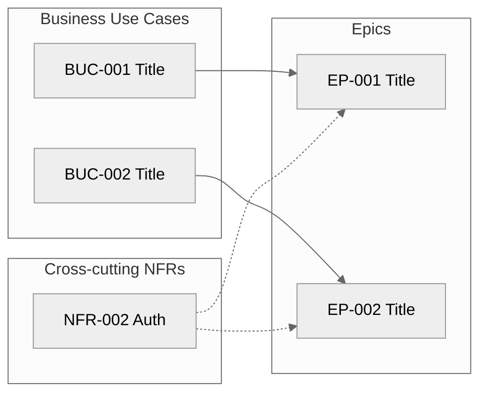

# Epics — Index — <!-- PROJECT_NAME -->

> **Last Updated:** <!-- LAST_UPDATED_DATE -->
>
> Auto-generated by `/create-epics` on every run from the current state of `epic-*.md` files in this folder.
> Do not edit manually — manual edits will be overwritten on the next run.

---

## 1. Project Overview

- **Project:** <!-- PROJECT_NAME -->
- **Source Artifact:** `artifacts/01-elicitation/elicitation-document.md` (status: Approved, version: <!-- elicit version -->)
- **Total Epics:** <!-- count -->
  - Pending: <!-- count -->
  - Accepted: <!-- count -->
  - Rejected: <!-- count -->
- **Coverage:** <!-- N --> Accepted FRs allocated, <!-- M --> Accepted NFRs allocated, <!-- K --> orphans flagged in Section 5.

---

## 2. Epic Map

<!-- One BUC node per Accepted BUC; one EP node per Epic. Solid arrow BUC -> EP. Cross-cutting NFRs as a separate floating subgraph linking to multiple Epics. Numeric-only node IDs (BUC001, EP001) — no hyphens. Short single-phrase labels. -->

---

## 3. Epic List

| ID | Title | Primary BUC(s) | Owner | Priority | Effort | Status | File |
|----|-------|----------------|-------|----------|--------|--------|------|
| EP-001 | <!-- Title --> | BUC-001 | SH-### | Must Have | M | Pending | [epic-001.md](epic-001.md) |

---

## 4. Coverage Matrix — Functional Requirements

<!-- Every Accepted FR with the Epic it belongs to. Status = Covered (in exactly one Epic), Orphan (in zero Epics — Critical OQ), or Duplicate (in >1 Epic — Critical OQ; FRs may not be cross-cutting). -->

| FR ID | Title | Priority | In Epic | Status |
|-------|-------|----------|---------|--------|
| FR-001 | <!-- Title --> | Must Have | EP-001 | Covered |

---

## 5. Coverage Matrix — Non-Functional Requirements

<!-- Every Accepted NFR with the Epic(s) it belongs to. Cross-cutting = Yes when In-Scope of more than one Epic. -->

| NFR ID | Title | Category | Measurable Target | In Epic(s) | Cross-cutting? |
|--------|-------|----------|-------------------|-----------|----------------|
| NFR-001 | <!-- Title --> | <!-- Performance --> | <!-- Target --> | EP-001 | No |
| NFR-002 | <!-- Title --> | <!-- Security --> | <!-- Target --> | EP-001, EP-002 | Yes |

---

## 6. Open Questions (across all Epics)

<!-- Aggregated from the Open Questions section of every epic-*.md file. Sorted by Severity: Critical → High → Medium → Low. Status filtered to Open + Partially Resolved (Resolved OQs are not shown here but remain in the originating Epic file's history). -->

| OQ ID | Severity | Question | Affecting Epic | Status |
|-------|----------|----------|----------------|--------|
| OQ-### | Critical | <!-- Critical example: FR-007 is Accepted but not In-Scope of any Epic. Which Epic should cover it? --> | EP-### | Open |
| OQ-### | High | <!-- High example: EP-001 was seeded by merging BUC-001 and BUC-002 (shared NFRs + same Primary Actor). Confirm the merger or instruct to keep separate. --> | EP-### | Open |
| OQ-### | Medium | <!-- Medium example: BUC-005 has no Accepted requirements yet — Epic seed deferred until at least one FR or NFR is accepted in /elicit. --> | — | Open |
| OQ-### | Low | <!-- Low example: EP-003 sized XL but has only 3 In-Scope FRs — verify the Effort heuristic with the team. --> | EP-### | Open |

---

## 7. Acceptance Status Overview

| ID | Title | Owner | Status | Accepted Date |
|----|-------|-------|--------|---------------|
| EP-001 | <!-- Title --> | SH-### | Pending | — |

---

## 8. Revision History

| Version | Date | Changed By | Changes |
|---------|------|-----------|---------|
| 1.0 | <!-- CREATION_DATE --> | create-epics skill (initial run) | Initial index — N Epics seeded, M FRs covered, K OQs raised |
