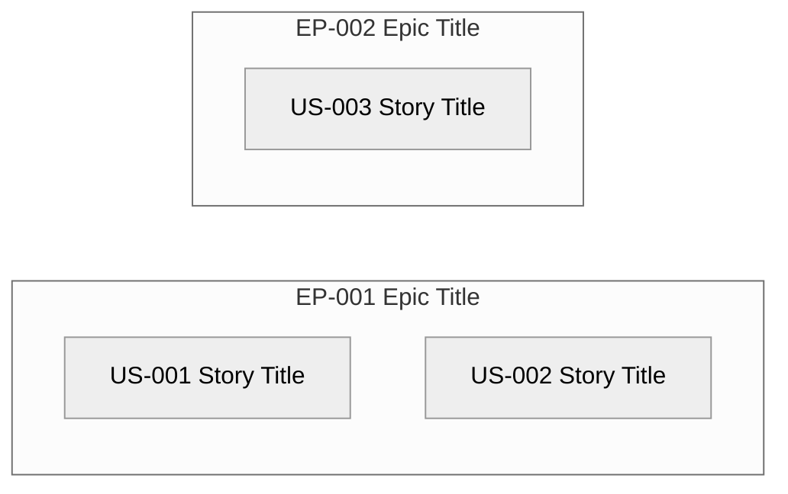

# User Stories — Index — <!-- PROJECT_NAME -->

> **Last Updated:** <!-- LAST_UPDATED_DATE -->
>
> Auto-generated by `/create-stories` on every run from the current state of `story-*.md` files in this folder.
> Do not edit manually — manual edits will be overwritten on the next run.

---

## 1. Project Overview

- **Project:** <!-- PROJECT_NAME -->
- **Source Artefacts:**
  - `artifacts/01-elicitation/elicitation-document.md` (status: Approved, version: <!-- elicit version -->)
  - `artifacts/02-epics/` (Accepted Epics: <!-- count -->; Pending: <!-- count -->; Rejected: <!-- count -->)
- **Total Stories:** <!-- count -->
  - Pending: <!-- count -->
  - Accepted: <!-- count -->
  - Rejected: <!-- count -->
- **Coverage:** <!-- N --> eligible Accepted FRs allocated, <!-- M --> orphans flagged in Section 4. Stories deferred (parent Epic not yet Accepted): <!-- D --> — see Section 5.

---

## 2. Story Map

<!-- One node per Accepted Epic with arrows to every Story under it. Numeric-only node IDs (EP001, US001) — no hyphens. Short single-phrase labels. -->

---

## 3. Story List

| ID | Title | Parent Epic | Parent FR | Owner | Priority | Story Points | Status | File |
|----|-------|-------------|-----------|-------|----------|--------------|--------|------|
| US-001 | <!-- Title --> | EP-001 | FR-001 | SH-### | Must Have | 3 | Pending | [story-001.md](story-001.md) |

---

## 4. Coverage Matrix — Functional Requirements (eligible only)

<!-- Every Accepted FR linked to an Accepted Epic with the Story it generated.
     Status = Covered (in exactly one Story), Orphan (in zero Stories — Critical OQ),
     Duplicate (in >1 Story — Critical OQ; FRs may not generate multiple Stories). -->

| FR ID | Title | Parent Epic | In Story | Status |
|-------|-------|-------------|----------|--------|
| FR-001 | <!-- Title --> | EP-001 | US-001 | Covered |

---

## 5. Stories Deferred (parent Epic not yet Accepted)

<!-- Informational only. Lists eligible FRs whose parent Epic is currently in Status = Pending or Rejected.
     Stories for these FRs are not minted this run — they will be minted on a future run after Epic Acceptance.
     If a parent Epic is Rejected and the FR is still Accepted: the human should reconcile upstream. -->

| FR ID | Parent Epic | Epic Status | Reason for Deferral |
|-------|-------------|-------------|---------------------|
| FR-### | EP-### | Pending | Parent Epic not Accepted yet |

---

## 6. Epic Grouping

<!-- For each Accepted Epic: list its Stories with Story Point totals so sprint planning can read the bundle at a glance. -->

### EP-001 — <!-- Epic Title -->

- Owner: SH-### | Priority: Must Have | Total Points: <!-- sum -->
- Stories:
  - US-001 (3 pts) — <!-- Title -->
  - US-002 (2 pts) — <!-- Title -->

### EP-002 — <!-- Epic Title -->

- Owner: SH-### | Priority: Must Have | Total Points: <!-- sum -->
- Stories:
  - US-003 (5 pts) — <!-- Title -->

---

## 7. Open Questions (across all Stories)

<!-- Aggregated from the Open Questions section of every story-*.md file. Sorted by Severity:
     Critical → High → Medium → Low. Status filtered to Open + Partially Resolved (Resolved
     OQs are not shown here but remain in the originating Story's history). -->

| OQ ID | Severity | Question | Affecting Story | Status |
|-------|----------|----------|-----------------|--------|
| OQ-### | Critical | <!-- Critical example: FR-007 has no Acceptance Criteria in the Elicitation Document. Story US-007 cannot be implemented without a testable definition of done. --> | US-### | Open |
| OQ-### | High | <!-- High example: US-005 sized at 13 points is too large for a single sprint. Consider splitting along ACs that test independent observable outcomes. --> | US-### | Open |
| OQ-### | Medium | <!-- Medium example: US-002 narrative role is unclear — FR-002's Stakeholder field references SH-007 which is not in the elicit doc. --> | US-### | Open |
| OQ-### | Low | <!-- Low example: US-009 references an FR description that uses informal "must" instead of RFC 2119 SHALL — not blocking but flagged for upstream cleanup. --> | US-### | Open |

---

## 8. Acceptance Status Overview

| ID | Title | Owner | Status | Accepted Date |
|----|-------|-------|--------|---------------|
| US-001 | <!-- Title --> | SH-### | Pending | — |

---

## 9. Revision History

| Version | Date | Changed By | Changes |
|---------|------|-----------|---------|
| 1.0 | <!-- CREATION_DATE --> | create-stories skill (initial run) | Initial index — N Stories minted across M Accepted Epics, K eligible FRs covered, J OQs raised |
