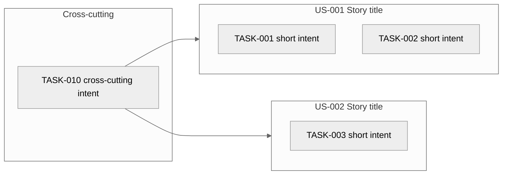

# Implementation Tasks — Index — <!-- PROJECT_NAME -->

> **Last Updated:** <!-- LAST_UPDATED_DATE -->
>
> Auto-generated by `/create-tasks` on every run from the current state of `task-*.md` files in this folder. Do not edit manually — manual edits will be overwritten on the next run.

---

## 1. Project Overview

- **Project:** <!-- PROJECT_NAME -->
- **Source Artefacts:**
  - `artifacts/04-srs/srs.md` (status: Accepted, version: <!-- SRS version -->)
  - `artifacts/03-user-stories/` (Accepted Story subset: <!-- N Accepted of M total -->)
  - `artifacts/05-test-concept/` (Test Cases linked into Tasks via `parent-tcs`)
- **Total Stories in Accepted subset:** <!-- N -->
- **Total Stories Deferred (Pending or parent Epic not yet Accepted):** <!-- N -->
- **Total Tasks:** <!-- N -->
  - Pending: <!-- N -->
  - Accepted: <!-- N -->
  - Rejected: <!-- N -->
  - Cross-cutting: <!-- N -->
- **Coverage:** <!-- N --> Stories covered, <!-- M --> orphans (Accepted Story with no Task), <!-- K --> AC-orphans (Accepted Story AC with no contributing Task).

---

## 2. Task Map

<!-- One subgraph per Accepted Story with arrows to every Task whose parent-story = US-###. Cross-cutting Tasks live in a separate subgraph at the bottom with edges to every linked Story. Numeric-only node IDs (US001, TASK001) — no hyphens. Short single-phrase labels. -->

---

## 3. Task List

| TASK ID | Title | Parent Story | Parent ACs | Parent TCs | Owner | Priority | Effort | Cross-cutting | Status | File |
|---------|-------|--------------|------------|------------|-------|----------|--------|----------------|--------|------|
| TASK-001 | <!-- Title --> | US-001 | AC-FR-001-01 | TC-001 | SH-### | Must Have | S | No | Pending | [task-001.md](task-001.md) |

---

## 4. Story Coverage Matrix

<!-- Every Accepted Story with the Task(s) it produced. Status:
       Covered = at least one Task exists for this Story, with at least one Task per AC
       Deferred = Story is Pending (or parent Epic is Pending) — no Task minted yet
       Orphan = Accepted Story has no Task (Critical: should never happen after /create-tasks runs) -->

| Story ID | Story title | AC count | Task count | Status | Notes |
|----------|------------|----------|------------|--------|-------|
| US-001 | <!-- title --> | 2 | 2 | Covered | — |
| US-002 | <!-- title --> | 1 | 0 | Deferred | parent Epic Pending |

---

## 5. AC Coverage Matrix

<!-- Every AC of every Accepted Story with the Task(s) that satisfy it. Status:
       Covered = at least one Task references this AC in parent-acs
       Orphan = AC has no contributing Task (High OQ raised) -->

| AC ID | Parent Story | Parent FR/NFR | Task(s) | Status |
|-------|--------------|---------------|---------|--------|
| AC-FR-001-01 | US-001 | FR-001 | TASK-001 | Covered |
| AC-FR-001-02 | US-001 | FR-001 | TASK-002 | Covered |

---

## 6. Effort Distribution (AI provisional)

<!-- Counts of Tasks per AI-provisional effort flag. The team confirms during sprint planning; this is the heuristic output, not a commitment. -->

| Effort | Count | Notes |
|--------|-------|-------|
| S | <!-- N --> | 1 AC, no Performance/Security/Reliability NFR exposure |
| M | <!-- N --> | 2–3 ACs OR 1 AC + 1 NFR threshold |
| L | <!-- N --> | 4+ ACs OR cross-cutting NFR with multi-Story scope |

---

## 7. Cross-Cutting Tasks

<!-- Tasks whose cross-cutting frontmatter = Yes. Each links to ≥2 Stories. The origin NFR (the cross-cutting NFR from the Epic phase that drives the Task) is named explicitly. If none: write "No cross-cutting Tasks in this Story subset." -->

| TASK ID | Title | Linked Stories | Origin NFR | Effort |
|---------|-------|----------------|------------|--------|
| TASK-010 | <!-- title --> | US-001, US-002 | NFR-002 (Session Authentication) | M |

---

## 8. Open Questions (across all Tasks)

<!-- Aggregated from the Open Questions section of every task-*.md file plus boundary-audit OQs raised in Step 6 of /create-tasks. Sorted by Severity: Critical → High → Medium → Low. -->

| OQ ID | Severity | Question | Affecting TASK / Story / AC | Status |
|-------|----------|----------|-----------------------------|--------|
| OQ-### | Critical | <!-- Critical example: TASK-### references AC-FR-007-01 which is no longer in the SRS canonical list. --> | TASK-### / AC-FR-007-01 | Open |
| OQ-### | High | <!-- High example: Boundary audit flagged TASK-### Intent containing "src/api/auth.ts" — rewrite as intent. --> | TASK-### | Open |
| OQ-### | Medium | <!-- Medium example: US-### produced 8 Tasks — consider re-running /create-stories with an AC split. --> | US-### | Open |
| OQ-### | Low | <!-- Low example: TASK-### effort flagged L but only 3 ACs and no NFR threshold — heuristic edge case worth team review. --> | TASK-### | Open |

---

## 9. Boundary Audit Summary

<!-- Count of Tasks flagged by /create-tasks Step 6 (codebase-awareness) validation. Each flagged Task is listed with its OQ-### reference. The skill does not auto-rewrite — the human reviewer either edits the Task to remove the leak or accepts the OQ with a justification. -->

- **Tasks scanned:** <!-- N -->
- **Tasks flagged:** <!-- N (target: 0) -->
- **Flagged Task / OQ pairs:**
  - TASK-### → OQ-### (e.g., "Intent contained framework name 'express'")

If `Tasks flagged: 0`: write `"Boundary audit clean — no codebase-specific content detected in any Task."`

---

## 10. Acceptance Status Overview

| TASK ID | Title | Owner | Status | Accepted Date |
|---------|-------|-------|--------|---------------|
| TASK-001 | <!-- Title --> | SH-### | Pending | — |

---

## 11. Revision History

| Version | Date | Changed By | Changes |
|---------|------|-----------|---------|
| 1.0 | <!-- CREATION_DATE --> | create-tasks skill (initial run) | Initial index — N Tasks minted across M Accepted Stories, K cross-cutting, J orphan OQs raised, L boundary-audit flags |
