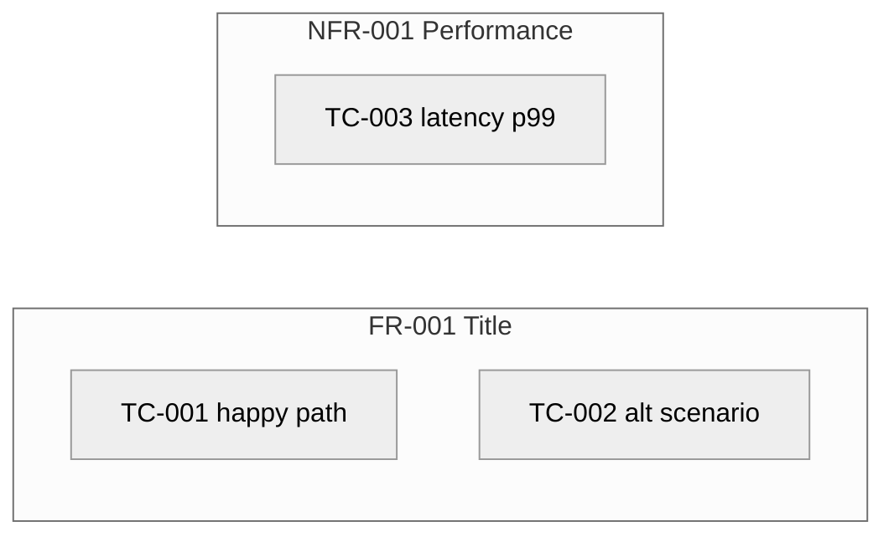

# Test Cases — Index — <!-- PROJECT_NAME -->

> **Last Updated:** <!-- LAST_UPDATED_DATE -->
>
> Auto-generated by `/create-tests` on every run from the current state of `test-case-*.md` files in this folder. Do not edit manually — manual edits will be overwritten on the next run.

---

## 1. Project Overview

- **Project:** <!-- PROJECT_NAME -->
- **Source Artefacts:**
  - `artifacts/04-srs/srs.md` (status: Accepted, version: <!-- SRS version -->)
  - Cross-checked against `artifacts/01-elicitation/elicitation-document.md` Section 6
- **Total ACs in SRS canonical list:** <!-- N -->
- **Total Test Cases:** <!-- N -->
  - Pending: <!-- N -->
  - Accepted: <!-- N -->
  - Rejected: <!-- N -->
- **Coverage:** <!-- N --> ACs covered, <!-- M --> orphans, <!-- K --> drift OQs raised against the elicit doc.

---

## 2. Test Map

<!-- One node per FR or NFR with arrows to every TC under it. Numeric-only node IDs (FR001, NFR001, TC001) — no hyphens. Short single-phrase labels. -->

---

## 3. Test Case List

| TC ID | Title | Parent AC | Parent FR/NFR | Owner | Priority | Type | Level | Status | File |
|-------|-------|-----------|---------------|-------|----------|------|-------|--------|------|
| TC-001 | <!-- Title --> | AC-FR-001-01 | FR-001 | SH-### | Must Have | Functional | Acceptance | Pending | [test-case-001.md](test-case-001.md) |

---

## 4. AC Coverage Matrix

<!-- Every AC in the SRS canonical list with the TC it generated. Status:
       Covered = exactly one TC exists for this AC
       Orphan = AC in SRS but no TC (Critical OQ raised)
       Duplicate = > 1 TC for this AC (Critical OQ raised) -->

| AC ID | Parent FR/NFR | TC ID | Status |
|-------|---------------|-------|--------|
| AC-FR-001-01 | FR-001 | TC-001 | Covered |

---

## 5. Type / Level Distribution

<!-- Informational summary. The team uses this to confirm the distribution matches their test pyramid. -->

| Type | Count | Levels |
|------|-------|--------|
| Functional | <!-- N --> | Acceptance: <!-- N -->, Integration: <!-- N -->, Unit: <!-- N --> |
| Performance | <!-- N --> | System: <!-- N --> |
| Security | <!-- N --> | System: <!-- N --> |
| Usability | <!-- N --> | System: <!-- N --> |
| Reliability | <!-- N --> | System: <!-- N --> |
| Compliance | <!-- N --> | System: <!-- N --> |

---

## 6. FR / NFR Coverage Summary

<!-- Helps the QA lead spot under-tested Must-Have requirements. -->

| FR/NFR ID | Title | Priority | TC count | Levels covered |
|-----------|-------|----------|----------|----------------|
| FR-001 | <!-- Title --> | Must Have | 2 | Acceptance |
| NFR-001 | <!-- Title --> | Must Have | 1 | System |

---

## 7. Open Questions (across all Test Cases)

<!-- Aggregated from the Open Questions section of every test-case-*.md file plus drift OQs raised in Step 3. Sorted by Severity: Critical → High → Medium → Low. -->

| OQ ID | Severity | Question | Affecting TC / AC | Status |
|-------|----------|----------|-------------------|--------|
| OQ-### | Critical | <!-- Critical example: AC-FR-007-01 has a TC (TC-007) but the AC itself is missing from the SRS canonical list — the lift in /create-srs may have been incorrect. --> | TC-### | Open |
| OQ-### | High | <!-- High example: AC-FR-002-01 text differs between SRS and elicit doc. SRS reads X; elicit reads Y. Reconcile upstream. --> | AC-FR-002-01 | Open |
| OQ-### | Medium | <!-- Medium example: AC-FR-009-01 exists in elicit doc but is not in SRS Section 8. Was it deferred? --> | AC-FR-009-01 | Open |
| OQ-### | Low | <!-- Low example: TC-005 has Type=Functional, Level=Acceptance but the AC's Then clause measures latency — consider Type=Performance instead. --> | TC-005 | Open |

---

## 8. Acceptance Status Overview

| TC ID | Title | Owner | Status | Accepted Date |
|-------|-------|-------|--------|---------------|
| TC-001 | <!-- Title --> | SH-### | Pending | — |

---

## 9. Revision History

| Version | Date | Changed By | Changes |
|---------|------|-----------|---------|
| 1.0 | <!-- CREATION_DATE --> | create-tests skill (initial run) | Initial index — N TCs minted across M FRs/NFRs, K drift OQs raised, J orphan OQs raised |
