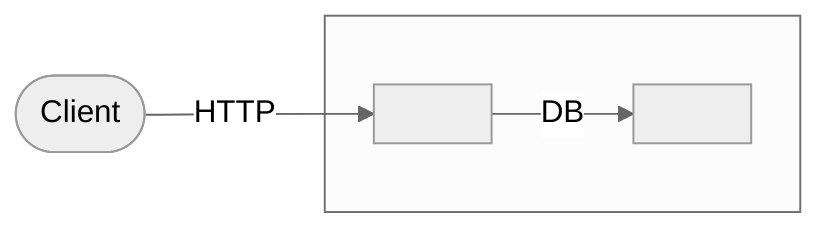
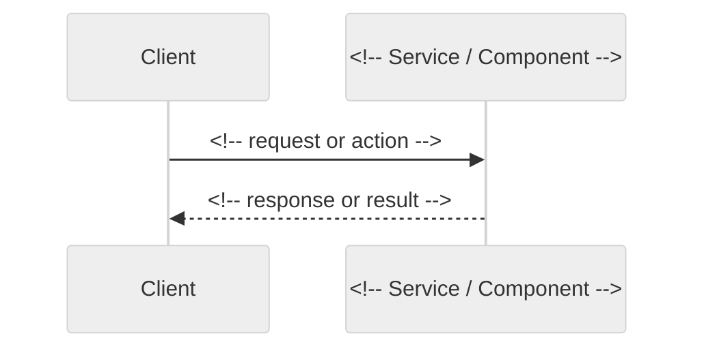

# Elicitation Document — <!-- PROJECT_NAME -->

> **Status:** Draft | **Created:** <!-- CREATION_DATE --> | **Last Updated:** <!-- LAST_UPDATED_DATE -->
>
> This is a living document. On updates: merge and annotate — do not regenerate from scratch.

---

## 1. Project Overview

**Project Name:** <!-- PROJECT_NAME -->
**Business Context:** <!-- One paragraph: what problem does this solve, what is the business driver -->
**Scope Summary:** <!-- What is in scope; what is explicitly out of scope -->
**Primary Contacts:** <!-- Who commissioned this work -->

---

## 2. Stakeholders

<!-- ID format: SH-001, SH-002, ... (sequential, never reused) -->
<!-- On update: add new rows; annotate existing rows with "Updated: YYYY-MM-DD — [source]" if new info found -->
<!-- Status values: Pending | Accepted | Rejected -->

| ID | Name | Role | Organization | Primary Concerns | Contact | Source | Status | Accepted Date |
|----|------|------|-------------|-----------------|---------|--------|--------|---------------|
| SH-001 | <!-- Name --> | <!-- Role --> | <!-- Org --> | <!-- Concerns --> | <!-- Email/Slack --> | <!-- input filename --> | Pending | — |

---

## 3. Business Use Cases

<!-- ID format: BUC-001, BUC-002, ... (sequential, never reused) -->
<!-- On update: add new BUC sections; append notes to existing BUCs rather than replacing -->

### 3.0 Use Case Diagram

<!-- Actors: one ([Role Name]) node per SH-xxx, placed left of the subgraph -->
<!-- Use cases: one node per BUC-xxx inside the system subgraph -->
<!-- Solid arrow (-->) = primary actor. Dashed arrow (-.->) = secondary actor -->
<!-- Node IDs must use numbers only, no hyphens: SH001, SH002, BUC001, BUC002 -->
<!-- System boundary label: replace "System Name" with the project name -->

---

### BUC-001: <!-- Title -->

- **Description:** <!-- What business activity this enables — not a technical feature -->
- **Primary Actor:** <!-- SH-xxx -->
- **Trigger:** <!-- What event or condition initiates this use case -->
- **Expected Outcome:** <!-- What success looks like at the business level -->
- **Stakeholders:** <!-- SH-001, SH-002 -->
- **Source:** <!-- input filename -->
- **Status:** Pending
- **Accepted By:** <!-- SH-xxx (primary actor by default; change if a different SH owns sign-off) -->
- **Accepted Date:** —

---

## 4. System Architecture Overview

> Diagrams in this section describe the software structure as understood during elicitation.
> They are derived from API definitions in `inputs/APIs/` or from architectural descriptions in other inputs.
> If a diagram is missing or was inferred from text, see Section 7 (Open Questions) for the relevant OQ.

### 4.0 Component Overview

<!-- COMP-001: one component diagram per document -->
<!-- Generated from inputs/APIs/ YAML (preferred) or inferred from textual inputs -->
<!-- Node labels: short component names (3–4 words max) -->
<!-- Edge labels: HTTP | gRPC | Event | DB | — (omit if unknown) -->
<!-- Actors/clients placed outside the subgraph; system components inside -->
<!-- On update: append new nodes/edges; never remove existing ones if Status=Accepted -->
<!-- Status values: Pending | Accepted | Rejected -->

- **Source:** <!-- input filename(s) -->
- **Status:** Pending
- **Accepted By:** <!-- SH-xxx (tech lead or architect; else most relevant SH-xxx) -->
- **Accepted Date:** —

---

### SEQ-001: <!-- Title — e.g., "Share Location" -->

<!-- ID format: SEQ-001, SEQ-002, ... (sequential, never reused) -->
<!-- One sequence diagram per BUC that has multi-step component interaction -->
<!-- Simple BUCs (single actor, single action, no inter-component calls) do not need a diagram -->
<!-- On update: add new SEQ sections; append notes to existing ones; never alter if Status=Accepted -->

- **Business Use Case:** <!-- BUC-xxx -->
- **Description:** <!-- What interaction this diagram shows at the component level -->
- **Source:** <!-- input filename(s) -->
- **Status:** Pending
- **Accepted By:** <!-- SH-xxx -->
- **Accepted Date:** —

---

## 5. Requirements

<!-- Functional: FR-001, FR-002, ... -->
<!-- Non-Functional: NFR-001, NFR-002, ... -->
<!-- Constraints: CON-001, CON-002, ... -->
<!-- All IDs: sequential within their category, never reused -->
<!-- On update: continue from the highest existing ID in each category -->

### 5.1 Functional Requirements

#### FR-001: <!-- Title -->

- **Description:** <!-- Full description of the requirement -->
- **Priority:** <!-- Must Have / Should Have / Could Have / Won't Have -->
- **Business Use Case:** <!-- BUC-xxx -->
- **Stakeholder:** <!-- SH-xxx -->
- **Source:** <!-- input filename, section or quote if relevant -->
- **Rationale:** <!-- Why this requirement exists -->
- **Acceptance Criteria:** See Section 6 — AC-FR-001-xx
- **Status:** Pending
- **Accepted By:** <!-- SH-xxx (from the Stakeholder field above) -->
- **Accepted Date:** —

---

### 5.2 Non-Functional Requirements

#### NFR-001: <!-- Title -->

- **Description:** <!-- Full description -->
- **Category:** <!-- Performance / Security / Usability / Reliability / Scalability / Maintainability / Compliance -->
- **Priority:** <!-- Must Have / Should Have / Could Have / Won't Have -->
- **Measurable Target:** <!-- Specific, testable metric — e.g., "response time < 200 ms at p99" -->
- **Business Use Case:** <!-- BUC-xxx or "General" -->
- **Source:** <!-- input filename -->
- **Acceptance Criteria:** See Section 6 — AC-NFR-001-xx
- **Status:** Pending
- **Accepted By:** <!-- SH-xxx (stakeholder most affected by this quality attribute) -->
- **Accepted Date:** —

---

### 5.3 Constraints

#### CON-001: <!-- Title -->

- **Description:** <!-- The constraint and its origin -->
- **Type:** <!-- Technology / Regulatory / Budget / Timeline / Organizational -->
- **Impact:** <!-- What design decisions this forces or excludes -->
- **Source:** <!-- input filename or "stated by SH-xxx" -->
- **Status:** Pending
- **Accepted By:** <!-- SH-xxx (stakeholder who imposed or is accountable for this constraint) -->
- **Accepted Date:** —

---

### 5.4 Assumptions

<!-- ID format: ASMP-001, ASMP-002, ... (sequential, never reused) -->
<!-- Status values: Pending | Validated | Invalidated -->
<!-- Owner must be an SH-xxx. If unknown, generate an OQ (Severity = High). -->
<!-- On update: protect Validated/Invalidated entries; append review note only -->

| ID | Description | Owner (SH-xxx) | Source | Rationale | Impact if Wrong | Status | Accepted By | Accepted Date |
|----|-------------|----------------|--------|-----------|-----------------|--------|-------------|---------------|
| ASMP-001 | <!-- Statement treated as true without current verification --> | <!-- SH-xxx --> | <!-- input filename --> | <!-- Why this assumption is being made --> | <!-- What breaks if this assumption is wrong --> | Pending | <!-- SH-xxx --> | — |

---

### 5.5 Risks

<!-- ID format: RSK-001, RSK-002, ... (sequential, never reused) -->
<!-- Likelihood and Impact values: H (High) | M (Medium) | L (Low) -->
<!-- Status values: Pending | Mitigated | Accepted | Closed -->
<!-- Owner must be an SH-xxx. If unknown, raise an OQ (Severity = High). -->
<!-- Mitigation = "TBD" triggers an OQ (Severity = High) -->
<!-- On update: protect Mitigated/Accepted/Closed entries; append review note only -->

| ID | Description | Likelihood (H/M/L) | Impact (H/M/L) | Owner (SH-xxx) | Mitigation | Source | Status | Accepted By | Accepted Date |
|----|-------------|-------------------|----------------|----------------|-----------|--------|--------|-------------|---------------|
| RSK-001 | <!-- Risk description — condition or event that could prevent achieving a goal --> | <!-- H/M/L --> | <!-- H/M/L --> | <!-- SH-xxx --> | <!-- How this risk will be reduced or handled --> | <!-- input filename --> | Pending | <!-- SH-xxx --> | — |

---

## 6. Acceptance Criteria

<!-- ID format: AC-[parent ID]-[two-digit sequence] -->
<!-- Examples: AC-FR-001-01, AC-FR-001-02, AC-NFR-001-01 -->
<!-- Use Given/When/Then for behavioural criteria (FR); use Criterion for measurable criteria (NFR) -->
<!-- Status values: Pending | Accepted | Rejected -->
<!-- Accepted By: pre-fill with the same SH-xxx as the parent requirement's Accepted By field -->
<!-- AC QUALITY RULES — apply at generation time and review time:
     1. ONE observable outcome per AC. If a Then clause contains two independent assertions joined by AND
        (or tests two separate features), split into separate ACs.
     2. Each AC must be independently executable — no AC should require another AC's post-condition as its starting state.
     3. Given must describe a complete, reproducible starting state.
     4. When must describe exactly one actor action or one system event.
     5. Then must be a verifiable, observable output — not an intent ("the system should try to...").
     6. NFR ACs: Criterion must copy the exact measurable threshold from the parent NFR's Measurable Target field verbatim.
-->

### FR-001 Acceptance Criteria

- **AC-FR-001-01**
  - **Given:** <!-- precondition -->
  - **When:** <!-- action -->
  - **Then:** <!-- expected result -->
  - **Status:** Pending
  - **Accepted By:** <!-- SH-xxx -->
  - **Accepted Date:** —

- **AC-FR-001-02**
  - **Given:** <!-- precondition -->
  - **When:** <!-- action -->
  - **Then:** <!-- expected result -->
  - **Status:** Pending
  - **Accepted By:** <!-- SH-xxx -->
  - **Accepted Date:** —

---

### NFR-001 Acceptance Criteria

- **AC-NFR-001-01**
  - **Criterion:** <!-- Measurable, testable criterion matching the NFR target -->
  - **Status:** Pending
  - **Accepted By:** <!-- SH-xxx -->
  - **Accepted Date:** —

---

## 7. Open Questions

<!-- ID format: OQ-001, OQ-002, ... (sequential, never reused even after resolution) -->
<!-- Status values: Open | Resolved | Deferred -->
<!-- Severity values: Critical (blocks APPROVED — invalid while Critical OQ is Open) | High (affects scope or architecture) | Medium (informational) | Low (cosmetic or deferred) -->
<!-- On update: check every "Open" row against new inputs; update Status, Answer, and Source if resolved -->
<!-- Critical OQs must be resolved before APPROVED is valid -->

| ID | Question | Context | Severity | Raised By | Assigned To | Deadline | Status | Answer |
|----|----------|---------|----------|-----------|-------------|----------|--------|--------|
| OQ-001 | <!-- Question text --> | <!-- Why unclear; which requirement it blocks or affects --> | Medium | <!-- SH-xxx or "elicit skill" --> | <!-- SH-xxx --> | <!-- YYYY-MM-DD --> | Open | — |

---

## 8. Acceptance Status Overview

> Auto-populated by the `/elicit` skill on every run. Do not edit manually.
> Rebuilt from the current acceptance fields in Sections 2–4 on each update.

### Stakeholders

| ID | Name | Role | Status | Accepted Date |
|----|------|------|--------|---------------|
| SH-001 | <!-- Name --> | <!-- Role --> | Pending | — |

### Business Use Cases

| ID | Title | Accepted By | Status | Accepted Date |
|----|-------|-------------|--------|---------------|
| BUC-001 | <!-- Title --> | <!-- SH-xxx --> | Pending | — |

### Component Overview

| ID | Title | Accepted By | Status | Accepted Date |
|----|-------|-------------|--------|---------------|
| COMP-001 | Component Overview | <!-- SH-xxx --> | Pending | — |

### Sequence Diagrams

| ID | Title | BUC | Accepted By | Status | Accepted Date |
|----|-------|-----|-------------|--------|---------------|
| SEQ-001 | <!-- Title --> | <!-- BUC-xxx --> | <!-- SH-xxx --> | Pending | — |

### Functional Requirements

| ID | Title | Accepted By | Status | Accepted Date |
|----|-------|-------------|--------|---------------|
| FR-001 | <!-- Title --> | <!-- SH-xxx --> | Pending | — |

### Non-Functional Requirements

| ID | Title | Accepted By | Status | Accepted Date |
|----|-------|-------------|--------|---------------|
| NFR-001 | <!-- Title --> | <!-- SH-xxx --> | Pending | — |

### Constraints

| ID | Title | Accepted By | Status | Accepted Date |
|----|-------|-------------|--------|---------------|
| CON-001 | <!-- Title --> | <!-- SH-xxx --> | Pending | — |

### Assumptions

| ID | Description (short) | Owner | Status | Accepted Date |
|----|---------------------|-------|--------|---------------|
| ASMP-001 | <!-- Short description --> | <!-- SH-xxx --> | Pending | — |

### Risks

| ID | Description (short) | Owner | Likelihood | Impact | Status | Accepted Date |
|----|---------------------|-------|-----------|--------|--------|---------------|
| RSK-001 | <!-- Short description --> | <!-- SH-xxx --> | <!-- H/M/L --> | <!-- H/M/L --> | Pending | — |

### Acceptance Criteria

| ID | Parent | Accepted By | Status | Accepted Date |
|----|--------|-------------|--------|---------------|
| AC-FR-001-01 | FR-001 | <!-- SH-xxx --> | Pending | — |

---

## 9. Traceability Summary

> Auto-populated by the `/trace` skill. Do not edit manually.

| Requirement | Business Use Case | Stakeholder | Epic | User Story | Test Case |
|-------------|------------------|-------------|------|------------|-----------|
| FR-001 | BUC-001 | SH-001 | — | — | — |

---

## 10. Revision History

| Version | Date | Changed By | Changes |
|---------|------|-----------|---------|
| 1.0 | <!-- CREATION_DATE --> | elicit skill (initial run) | Initial creation |
