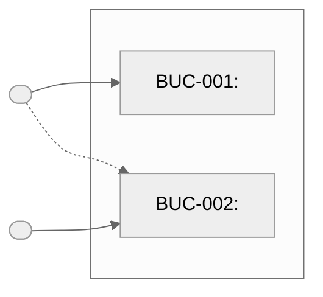

# Elicitation Document — <!-- PROJECT_NAME -->

> **Status:** Draft | **Created:** <!-- CREATION_DATE --> | **Last Updated:** <!-- LAST_UPDATED_DATE -->
>
> This is a living document. On updates: merge and annotate — do not regenerate from scratch.

---

## 1. Project Overview

**Project Name:** <!-- PROJECT_NAME -->
**Business Context:** <!-- One paragraph: what problem does this solve, what is the business driver -->
**Scope Summary:** <!-- What is in scope; what is explicitly out of scope -->
**Primary Contacts:** <!-- Who commissioned this work -->

---

## 2. Stakeholders

<!-- ID format: SH-001, SH-002, ... (sequential, never reused) -->
<!-- On update: add new rows; annotate existing rows with "Updated: YYYY-MM-DD — [source]" if new info found -->
<!-- Status values: Pending | Accepted | Rejected -->

| ID | Name | Role | Organization | Primary Concerns | Contact | Source | Status | Accepted Date |
|----|------|------|-------------|-----------------|---------|--------|--------|---------------|
| SH-001 | <!-- Name --> | <!-- Role --> | <!-- Org --> | <!-- Concerns --> | <!-- Email/Slack --> | <!-- input filename --> | Pending | — |

---

## 3. Business Use Cases

<!-- ID format: BUC-001, BUC-002, ... (sequential, never reused) -->
<!-- On update: add new BUC sections; append notes to existing BUCs rather than replacing -->

### 3.0 Use Case Diagram

<!-- Actors: one ([Role Name]) node per SH-xxx, placed left of the subgraph -->
<!-- Use cases: one node per BUC-xxx inside the system subgraph -->
<!-- Solid arrow (-->) = primary actor. Dashed arrow (-.->) = secondary actor -->
<!-- Node IDs must use numbers only, no hyphens: SH001, SH002, BUC001, BUC002 -->
<!-- System boundary label: replace "System Name" with the project name -->

---

### BUC-001: <!-- Title -->

- **Description:** <!-- What business activity this enables — not a technical feature -->
- **Primary Actor:** <!-- SH-xxx -->
- **Trigger:** <!-- What event or condition initiates this use case -->
- **Expected Outcome:** <!-- What success looks like at the business level -->
- **Stakeholders:** <!-- SH-001, SH-002 -->
- **Source:** <!-- input filename -->
- **Status:** Pending
- **Accepted By:** <!-- SH-xxx (primary actor by default; change if a different SH owns sign-off) -->
- **Accepted Date:** —

---

## 4. Requirements

<!-- Functional: FR-001, FR-002, ... -->
<!-- Non-Functional: NFR-001, NFR-002, ... -->
<!-- Constraints: CON-001, CON-002, ... -->
<!-- All IDs: sequential within their category, never reused -->
<!-- On update: continue from the highest existing ID in each category -->

### 4.1 Functional Requirements

#### FR-001: <!-- Title -->

- **Description:** <!-- Full description of the requirement -->
- **Priority:** <!-- Must Have / Should Have / Could Have / Won't Have -->
- **Business Use Case:** <!-- BUC-xxx -->
- **Stakeholder:** <!-- SH-xxx -->
- **Source:** <!-- input filename, section or quote if relevant -->
- **Rationale:** <!-- Why this requirement exists -->
- **Acceptance Criteria:** See Section 5 — AC-FR-001-xx
- **Status:** Pending
- **Accepted By:** <!-- SH-xxx (from the Stakeholder field above) -->
- **Accepted Date:** —

---

### 4.2 Non-Functional Requirements

#### NFR-001: <!-- Title -->

- **Description:** <!-- Full description -->
- **Category:** <!-- Performance / Security / Usability / Reliability / Scalability / Maintainability / Compliance -->
- **Priority:** <!-- Must Have / Should Have / Could Have / Won't Have -->
- **Measurable Target:** <!-- Specific, testable metric — e.g., "response time < 200 ms at p99" -->
- **Business Use Case:** <!-- BUC-xxx or "General" -->
- **Source:** <!-- input filename -->
- **Acceptance Criteria:** See Section 5 — AC-NFR-001-xx
- **Status:** Pending
- **Accepted By:** <!-- SH-xxx (stakeholder most affected by this quality attribute) -->
- **Accepted Date:** —

---

### 4.3 Constraints

#### CON-001: <!-- Title -->

- **Description:** <!-- The constraint and its origin -->
- **Type:** <!-- Technology / Regulatory / Budget / Timeline / Organizational -->
- **Impact:** <!-- What design decisions this forces or excludes -->
- **Source:** <!-- input filename or "stated by SH-xxx" -->
- **Status:** Pending
- **Accepted By:** <!-- SH-xxx (stakeholder who imposed or is accountable for this constraint) -->
- **Accepted Date:** —

---

## 5. Acceptance Criteria

<!-- ID format: AC-[parent ID]-[two-digit sequence] -->
<!-- Examples: AC-FR-001-01, AC-FR-001-02, AC-NFR-001-01 -->
<!-- Use Given/When/Then for behavioural criteria (FR); use Criterion for measurable criteria (NFR) -->
<!-- Status values: Pending | Accepted | Rejected -->
<!-- Accepted By: pre-fill with the same SH-xxx as the parent requirement's Accepted By field -->

### FR-001 Acceptance Criteria

- **AC-FR-001-01**
  - **Given:** <!-- precondition -->
  - **When:** <!-- action -->
  - **Then:** <!-- expected result -->
  - **Status:** Pending
  - **Accepted By:** <!-- SH-xxx -->
  - **Accepted Date:** —

- **AC-FR-001-02**
  - **Given:** <!-- precondition -->
  - **When:** <!-- action -->
  - **Then:** <!-- expected result -->
  - **Status:** Pending
  - **Accepted By:** <!-- SH-xxx -->
  - **Accepted Date:** —

---

### NFR-001 Acceptance Criteria

- **AC-NFR-001-01**
  - **Criterion:** <!-- Measurable, testable criterion matching the NFR target -->
  - **Status:** Pending
  - **Accepted By:** <!-- SH-xxx -->
  - **Accepted Date:** —

---

## 6. Open Questions

<!-- ID format: OQ-001, OQ-002, ... (sequential, never reused even after resolution) -->
<!-- Status values: Open | Resolved | Deferred -->
<!-- On update: check every "Open" row against new inputs; update Status, Answer, and Source if resolved -->
<!-- Unresolved open questions do not block APPROVED, but are flagged prominently at the review gate -->

| ID | Question | Context | Raised By | Assigned To | Deadline | Status | Answer |
|----|----------|---------|-----------|-------------|----------|--------|--------|
| OQ-001 | <!-- Question text --> | <!-- Why unclear; which requirement it blocks or affects --> | <!-- SH-xxx or "elicit skill" --> | <!-- SH-xxx --> | <!-- YYYY-MM-DD --> | Open | — |

---

## 7. Acceptance Status Overview

> Auto-populated by the `/elicit` skill on every run. Do not edit manually.
> Rebuilt from the current acceptance fields in Sections 2–5 on each update.

### Stakeholders

| ID | Name | Role | Status | Accepted Date |
|----|------|------|--------|---------------|
| SH-001 | <!-- Name --> | <!-- Role --> | Pending | — |

### Business Use Cases

| ID | Title | Accepted By | Status | Accepted Date |
|----|-------|-------------|--------|---------------|
| BUC-001 | <!-- Title --> | <!-- SH-xxx --> | Pending | — |

### Functional Requirements

| ID | Title | Accepted By | Status | Accepted Date |
|----|-------|-------------|--------|---------------|
| FR-001 | <!-- Title --> | <!-- SH-xxx --> | Pending | — |

### Non-Functional Requirements

| ID | Title | Accepted By | Status | Accepted Date |
|----|-------|-------------|--------|---------------|
| NFR-001 | <!-- Title --> | <!-- SH-xxx --> | Pending | — |

### Constraints

| ID | Title | Accepted By | Status | Accepted Date |
|----|-------|-------------|--------|---------------|
| CON-001 | <!-- Title --> | <!-- SH-xxx --> | Pending | — |

### Acceptance Criteria

| ID | Parent | Accepted By | Status | Accepted Date |
|----|--------|-------------|--------|---------------|
| AC-FR-001-01 | FR-001 | <!-- SH-xxx --> | Pending | — |

---

## 8. Traceability Summary

> Auto-populated by the `/trace` skill. Do not edit manually.

| Requirement | Business Use Case | Stakeholder | Epic | User Story | Test Case |
|-------------|------------------|-------------|------|------------|-----------|
| FR-001 | BUC-001 | SH-001 | — | — | — |

---

## 9. Revision History

| Version | Date | Changed By | Changes |
|---------|------|-----------|---------|
| 1.0 | <!-- CREATION_DATE --> | elicit skill (initial run) | Initial creation |
