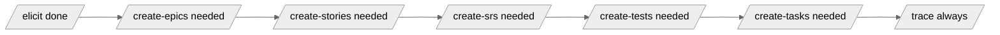
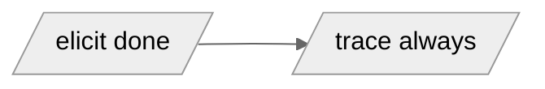

# Skill: update

**Purpose:** Produce a single Update Report at `artifacts/00-updates/update-YYYY-MM-DD-NN.md` summarising what changed in the Elicitation Document and downstream artefacts since the previous Update Report, and recommending which downstream skills to re-run to bring the pipeline back to a consistent state. The skill is the framework's **update coordinator** — it runs after `/elicit` has been re-run with new inputs and APPROVED, compares the current pipeline state against the element snapshot embedded in the previous Update Report (if any), and writes a fresh dated report. The skill is diagnostic, not generative: it mints no IDs, modifies no upstream artefact, never invokes another skill, and has no APPROVED gate of its own. Re-runs always produce a new dated file; prior reports persist for audit. The skill is forward-compatible with Component 3 (the Amendment Protocol): Section 3.5 of the Update Report template is a placeholder that becomes a populated table once `AM-###` amendment proposals exist.

**Invocation:**
- Claude Code: `/update`
- GitHub Copilot: "Run the update skill" or "Follow `skills/update/skill.md`"

**Inputs (all optional except the elicit doc):**
- `artifacts/01-elicitation/elicitation-document.md` — required; the canonical source of element state for SH / BUC / FR / NFR / CON / AC / ASMP / RSK / OQ
- `inputs/manifest.md` — informational; used to populate Section 2 (Inputs Processed Since Last Run) and to determine `last-modified-by` per element
- `artifacts/00-updates/update-*.md` — previous Update Reports; the highest-dated + highest-NN file is the baseline for delta computation
- `artifacts/02-epics/`, `artifacts/03-user-stories/`, `artifacts/04-srs/`, `artifacts/05-test-concept/`, `artifacts/07-implementation-tasks/` — used for the Pipeline State After /elicit section and the recommendation heuristics

**Outputs:**
- `artifacts/00-updates/update-YYYY-MM-DD-NN.md` — one new file per run. **Never overwrites a prior report.** `NN` is a per-day sequence (01, 02, ...) auto-incremented for same-day re-runs.

---

## Step 0 — No gate; ensure prerequisites exist

`/update` is diagnostic, not generative. It runs whenever the user invokes it. There is no upstream-Approved gate.

Two hard prerequisites:

- If `artifacts/01-elicitation/elicitation-document.md` does not exist: stop with `"Run /elicit first; no elicit doc to derive an update report from."`
- If `inputs/` is empty (no files, only a README): stop with `"No inputs in inputs/; /update has nothing to coordinate. Drop input documents into inputs/ and run /elicit first."`

No other gates. The skill operates on whatever pipeline state exists.

---

## Step 1 — Locate the previous Update Report

Read every file matching `artifacts/00-updates/update-*.md` (excluding `.gitkeep`).

If none exist:

- `prev_snapshot = None`
- Flag this run as **first run**; the report's frontmatter records `previous-report: "none (first run)"`
- `next_run_number = 01` (always 01 for first run)

If one or more exist:

- Sort by `run-date` (descending), then by `run-number` (descending)
- Take the first entry as `previous_report`
- Parse its Appendix A YAML block — capture as `prev_snapshot` (mapping `id → {type, status, content-hash, last-modified-by}`)
- For `next_run_number`:
  - If any existing report has today's `run-date`: take the max `run-number` for today, increment by 1
  - Otherwise: `01`
  - Format as zero-padded two-digit string

---

## Step 2 — Snapshot the current pipeline state

Walk every artefact in the pipeline and build `current_snapshot` — a mapping `id → {type, status, content-hash, last-modified-by}` for every first-class element.

For each element in the pipeline:

| Source artefact | Elements to extract |
|-----------------|---------------------|
| `elicitation-document.md` | SH-### (§3), BUC-### (§3), FR-### / NFR-### / CON-### (§5), AC-FR-###-NN / AC-NFR-###-NN (§6), ASMP-### / RSK-### (§7), OQ-### (§7) |
| `artifacts/02-epics/epic-*.md` | EP-### (frontmatter `status`, body content) |
| `artifacts/03-user-stories/story-*.md` | US-### (frontmatter `status`, body content) |
| `artifacts/04-srs/srs.md` | The SRS itself as one element (id = `SRS`, status = frontmatter `status`, content-hash = sha256 of body); does NOT re-extract FR/NFR/CON/AC (those are in elicit doc) |
| `artifacts/05-test-concept/test-case-*.md` | TC-### (frontmatter `status`) |
| `artifacts/07-implementation-tasks/task-*.md` | TASK-### (frontmatter `status`) |

For each element compute:

- **id:** canonical identifier
- **type:** SH / BUC / FR / NFR / CON / AC / ASMP / RSK / OQ / EP / US / SRS / TC / TASK
- **status:** the value present in the element's frontmatter or status line — never reinterpreted (Pending / Accepted / Rejected / Open / Resolved / Validated / Invalidated / Mitigated / Closed depending on element type)
- **content-hash:** sha256 of the element's normalised body content. **Normalisation rules:** strip leading/trailing whitespace; collapse internal whitespace runs (spaces + tabs + newlines) to single spaces; preserve case; the hash is computed on the original normalised content (do not lowercase for hashing). Output as lowercase hex digest, 64 chars.
- **last-modified-by:** for elements minted/refined by `/elicit`: the filename in `inputs/manifest.md` whose most recent processing line mentions this element ID. For elements minted by downstream skills (TCs, TASKs, EPs, USs, SRS): the literal string `"skill-generated"`.

`current_snapshot` is the canonical state record for this run.

---

## Step 3 — Compute the delta

Compare `current_snapshot` against `prev_snapshot`.

If `prev_snapshot` is `None` (first run): every element is reported as "baseline" — none of the categories below apply; Sections 3.1 through 3.4 of the report show `"(none — first run)"`. Section 3.5 shows the Component-3 placeholder text. Continue to Step 4 with an empty delta (Step 4 will recommend only `/trace`).

Otherwise apply these classification rules to each element ID across the union of `prev_snapshot` and `current_snapshot`:

| Classification | Detection rule | Section in report |
|----------------|----------------|-------------------|
| **New element** | ID present in `current_snapshot` and absent from `prev_snapshot` | 3.1 |
| **Pending refined** | ID in both; `prev.status == "Pending"`; `prev.content-hash != current.content-hash` | 3.2 |
| **OQ resolved** | ID is an OQ; `prev.status == "Open"`; `current.status == "Resolved"` | 3.3 |
| **OQ newly raised** | ID is an OQ; absent from `prev_snapshot`; present in `current_snapshot` with `status: Open` | 3.4 |
| **Status transition (non-OQ)** | ID in both; `prev.status != current.status`; not an OQ-resolved or Pending-refined case | 1 (counter only) |
| **Anomalous content change** | ID in both; `prev.status` is something other than `Pending` (i.e., `Accepted` / `Rejected` / `Resolved` / `Validated` / `Invalidated` / `Mitigated` / `Closed`); `prev.content-hash != current.content-hash` | 1 (counter) + 3.5 Note |
| **No change** | ID in both; status same; content-hash same | not reported |

The **anomalous content change** category is the Component-3 forward-compatibility hook. Component 1 does not have an amendment-proposal mechanism, so for each anomaly the skill records a Note in Section 3.5 of the report:

> `Note: TASK-### shows content-hash drift on Accepted element. Component 3 (Amendment Protocol) is required to handle this case properly. Manual reconciliation required: review the element, decide whether to flip status back to Pending (allowing refinement) or to keep the Accepted version (treating the input change as out-of-scope).`

When Component 3 ships, the anomaly path is replaced by `AM-###` amendment proposals raised inside `/elicit` itself; `/update` just surfaces them in 3.5 as a table.

---

## Step 4 — Determine downstream re-run recommendations

Apply the published heuristic table to the delta. **Every recommendation carries its triggering rationale** (the specific element IDs that caused it) — this rationale renders in Section 4 of the report.

| Recommend | Triggered when |
|-----------|----------------|
| `/create-epics` | The delta contains at least one new FR or NFR; OR any FR or NFR is in `Pending refined` and its `Business Use Case` field changed (the `Business Use Case` field is detectable by comparing the relevant sub-string of the element body) |
| `/create-stories` | The delta contains a new FR; OR a refined Pending FR whose `parent-fr` is referenced by an existing Story; OR a refined AC under an FR that has a Story |
| `/create-srs` | The delta contains any element that is now Accepted-and-in-scope (per the partial-by-Epic rule) that was not in the current SRS body. **Caveat (Component 1):** since the SRS baselining protocol is not yet shipped, the recommendation includes the text `"Manual workaround until Component 2: Reject the Accepted SRS, then re-run /create-srs to publish a new version."` |
| `/create-tests` | `/create-srs` was recommended (above); OR any new AC was minted; OR any refined AC under an existing TC's `parent-ac` |
| `/create-tasks` | A new Story is now Accepted under an Accepted Epic; OR a Task's `parent-ac` is in the delta |
| `/trace` | **Always** — to verify chain integrity after the recommended cascade completes |

If no triggers fire other than `/trace`: Section 4 of the report contains only the `/trace` recommendation with the note `"No upstream changes recommend a downstream re-run; /trace is recommended only to confirm chain integrity."`

The skill **never invokes** any of these — it only recommends.

---

## Step 5 — Build the Mermaid cascade diagram

Render Section 5 of the Update Report as a Mermaid `flowchart LR` showing exactly the recommended re-runs in their dependency order. Skills NOT recommended are omitted.

Vault Mermaid rules apply: `%%{init: {'theme': 'neutral'}}%%` first line; short single-phrase labels; no ` `.

Example (full cascade):

Example (only `/trace` recommended):

---

## Step 6 — Write the Update Report

Render `artifacts/00-updates/update-YYYY-MM-DD-NN.md` from `skills/update/templates/update-report.md`. Populate:

- **Frontmatter:** `run-date` (today), `run-number` (from Step 1), `previous-report`, `inputs-processed` (from `inputs/manifest.md` — only the files processed in the most recent `/elicit` run, not the full history)
- **Section 1:** narrative + counters from the delta
- **Section 2:** table built from the manifest (one row per input file processed in the most recent `/elicit` run)
- **Section 3.1 — 3.4:** tables populated from the delta classifications
- **Section 3.5:** Component-3 placeholder text plus any Anomalous-content-change Notes from Step 3
- **Section 4:** ordered recommendation list from Step 4
- **Section 5:** Mermaid diagram from Step 5
- **Section 6:** Pipeline state — read each artefact's frontmatter / index, fill the table
- **Section 7:** Open Questions table aggregated from elicit doc + every downstream artefact (current statuses)
- **Section 8:** Revision History — single row for this run
- **Appendix A:** the YAML snapshot from Step 2

If `artifacts/00-updates/` does not exist: create the directory.

The file is **always a fresh file**, never overwriting prior reports.

---

## Step 7 — Review summary (no APPROVED)

Present to the user:

> **Update report — `<PROJECT_NAME>`, run `<YYYY-MM-DD-NN>`**
> - **Previous report:** `<previous filename>` or `"none (first run)"`
> - **Inputs processed since previous report:** `<count and one-line list>`
> - **Element-level deltas:**
>   - New: `<N>`
>   - Refined Pending: `<N>`
>   - OQs resolved: `<N>`
>   - OQs newly raised: `<N>`
>   - Status transitions: `<N>`
>   - Anomalous content changes: `<N>` (manual reconciliation required until Component 3)
> - **Recommended downstream re-runs (in order):** `<list with one-line rationale per item, or "/trace only">`
> - **Open Questions across the pipeline:** `<count by severity>`
>
> Read `artifacts/00-updates/<filename>.md` for the full report (cascade Mermaid diagram + Appendix A snapshot).
> There is no APPROVED prompt — `/update` is informational. Proceed by invoking each recommended downstream skill in order, reviewing and Approving its review gate as usual. After the cascade, re-run `/update` to confirm the next baseline.

If the delta is empty (no changes since the previous report): state `"No changes detected since the previous Update Report. The new report at <filename> captures the current snapshot as the next-run baseline. Only /trace is recommended."`

If this is the first run: state `"First Update Report for this project. The Appendix A snapshot is the baseline for future delta computation. No downstream re-runs recommended at this time (re-run /trace to confirm chain integrity)."`

---

## ID Reference

| Artifact | Format | Example | Source |
|----------|--------|---------|--------|
| Update Report (filename) | `update-YYYY-MM-DD-NN.md` | `update-2026-05-20-01.md` | minted by this skill |

`/update` mints no element-level IDs. It does not add to the OQ-### namespace (findings render inline in the report). It does not modify any upstream artefact.

When Component 3 ships, the AM-### (Amendment Proposal) namespace will be minted by `/elicit`, not by `/update`. `/update` will only surface AM-### proposals already present in the elicit doc.

---

## Edge Cases

| Situation | Action |
|-----------|--------|
| `artifacts/01-elicitation/elicitation-document.md` does not exist | Stop at Step 0; instruct user to run `/elicit` first |
| `inputs/` is empty | Stop at Step 0; instruct user to drop inputs and run `/elicit` first |
| `artifacts/00-updates/` does not exist | Create it in Step 6 |
| No previous Update Report (first run) | `prev_snapshot = None`; report's frontmatter shows `previous-report: "none (first run)"`; Sections 3.1–3.4 show `"(none — first run)"`; Step 4 recommends only `/trace` |
| Two `/update` runs on the same date | The second run's filename is `update-YYYY-MM-DD-02.md`; subsequent same-day runs continue (03, 04, ...) |
| Anomalous content change on a non-Pending element (Accepted / Rejected / Validated / etc.) | Counted in Section 1; surfaced in Section 3.5 with a Note explaining that Component 3 is required for proper handling; manual reconciliation required |
| Manual edit to the elicit doc between `/elicit` runs | Detected via content-hash drift; treated like an Anomalous content change unless the affected element is Pending (then treated as a Pending refinement) |
| `inputs/manifest.md` missing | Section 2 of the report renders `"(inputs/manifest.md not found — cannot determine which inputs were processed in the most recent /elicit run)"`; the rest of the report proceeds normally using element-level content-hashes for delta detection |
| `prev_snapshot` exists but is malformed (corrupted YAML in Appendix A) | Treat as first run; warn in Section 1: `"Previous Update Report's Appendix A was unparseable; treating this as a baseline run. The previous report at <filename> may need manual repair."` |
| Existing Update Report was edited manually | Not detected by this skill (it never re-reads a prior report's body, only its Appendix A). Manual edits to prior reports are not preserved by any framework operation but `/update` does not warn about them. The reports are immutable audit records; do not edit them. |
| The pipeline has only the elicit doc (downstream artefacts absent) | Sections 3.1–3.4 work normally for elicit-level deltas; Section 6 (Pipeline State) shows downstream phases as `(absent)`; Step 4 recommends only `/create-epics` (and onward) if new FRs/NFRs exist, or only `/trace` otherwise |
| Component 3 ships and `AM-###` proposals exist in the elicit doc | Step 3 surfaces them in Section 3.5 (the placeholder text is replaced by a table); Step 4 may recommend extra re-runs based on which Accepted elements have pending amendments |
