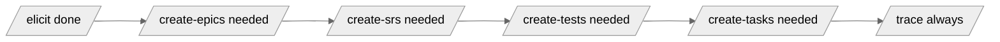

# Update Report — <!-- PROJECT_NAME --> — <!-- YYYY-MM-DD --> run <!-- NN -->

> **Status:** Auto-generated | **Run:** <!-- YYYY-MM-DD-NN --> | **Previous report:** <!-- filename or "none (first run)" -->
>
> Auto-generated by `/update` after `/elicit` was re-run and Approved with new inputs. **Do not edit manually** — manual edits are not preserved and the file is part of the framework's immutable audit trail of inter-run deltas. Each `/update` run produces a new dated file; prior reports persist for historical reference.

---

## 1. Run Summary

<!-- One-paragraph narrative describing this run plus a counts table.
     For the first run (no previous report): say so explicitly and describe the report as the baseline snapshot.
     For subsequent runs: name the previous report, summarise the delta in one sentence, list the recommended downstream re-runs in inline form. -->

<!-- e.g. "This is the first Update Report for <PROJECT_NAME>. The Appendix A snapshot captures the current state of every first-class element across the pipeline and serves as the baseline for future delta computation." -->

<!-- e.g. "This run picked up 1 new stakeholder, 1 new NFR (NFR-005 encryption-at-rest), and 1 OQ resolution since the previous report (update-2026-05-19-01.md). Recommended downstream re-runs: /create-epics → /create-srs → /create-tests → /create-tasks → /trace." -->

| Counter | Value |
|---|---|
| Inputs processed since previous report | <!-- N --> |
| New elements minted | <!-- N --> |
| Pending elements refined | <!-- N --> |
| OQs resolved | <!-- N --> |
| OQs newly raised | <!-- N --> |
| Status transitions (Pending → Accepted, etc.) | <!-- N --> |
| Amendment Proposals raised (Component 3) | <!-- 0 until Component 3 ships --> |
| Anomalous content changes detected | <!-- N (manual reconciliation required until Component 3) --> |

---

## 2. Inputs Processed Since Last Run

<!-- Table of input files considered in the most recent /elicit run. Lifted from inputs/manifest.md.
     "OQs Resolved" lists the OQ-### values resolved by each input file in the most recent /elicit run.
     "Elements Affected" lists the IDs of any element minted, refined, or otherwise touched while processing this input. -->

| Filename | Type | One-line summary | OQs Resolved | Elements Affected |
|---|---|---|---|---|
| <!-- meeting-minutes-2026-05-20.md --> | <!-- meeting minutes --> | <!-- one line --> | <!-- OQ-005 --> | <!-- SH-005, NFR-005 --> |

---

## 3. Element-Level Deltas

<!-- Sub-sectioned by category. Each sub-section's table lists exactly what changed between the previous snapshot
     (Appendix A of the previous Update Report) and the current snapshot. For the first run, every sub-section
     except 3.5 contains "(none — first run)". -->

### 3.1 New elements

<!-- Elements present in the current snapshot but absent from the previous. Always Pending on first appearance. -->

| ID | Type | Title | Status | Source Input | Notes |
|---|---|---|---|---|---|
| <!-- NFR-005 --> | <!-- NFR --> | <!-- Encryption at rest --> | <!-- Pending --> | <!-- meeting-minutes-2026-05-20.md --> | <!-- — --> |

### 3.2 Pending elements refined

<!-- Elements in both snapshots; status was Pending in the previous; content-hash changed. -->

| ID | Type | Title | What changed | Source Input |
|---|---|---|---|---|
| <!-- FR-003 --> | <!-- FR --> | <!-- View Contact Live Location --> | <!-- Description expanded to include staleness indicator --> | <!-- meeting-minutes-2026-05-20.md --> |

### 3.3 OQs resolved

<!-- OQs in the previous snapshot with status Open, in the current snapshot with status Resolved. -->

| OQ-### | Question | Resolution summary | Source Input |
|---|---|---|---|
| <!-- OQ-005 --> | <!-- Whether to merge BUC-001 and BUC-002 into EP-001 --> | <!-- Confirmed: keep merged as EP-001 --> | <!-- meeting-minutes-2026-05-20.md --> |

### 3.4 OQs newly raised

<!-- OQs in the current snapshot that were not in the previous. -->

| OQ-### | Severity | Question | Affected Element(s) |
|---|---|---|---|
| <!-- OQ-012 --> | <!-- Medium --> | <!-- Is the new NFR-005 in scope of EP-001 only, or cross-cutting? --> | <!-- NFR-005, EP-001 --> |

### 3.5 Amendment Proposals (Component 3 placeholder)

<!-- Until Component 3 (Amendment protocol) ships, this section always reads:
     "(none — amendment protocol not yet shipped; the framework currently has no formal mechanism for amending Accepted elements.
     If a new input states content that conflicts with an Accepted element, /elicit raises a Critical OQ and the human reconciles manually.
     See the Anomalous content changes counter in Section 1.)"

     When Component 3 ships, this section becomes a table:
     | AM-### | Element ID | Source Input | Proposed Change | Severity | Status |
-->

(none — amendment protocol not yet shipped; the framework currently has no formal mechanism for amending Accepted elements. If a new input states content that conflicts with an Accepted element, `/elicit` raises a Critical OQ and the human reconciles manually. See the Anomalous content changes counter in Section 1.)

---

## 4. Recommended Downstream Re-Runs

<!-- Ordered list of skill invocations the human should perform in sequence to bring the pipeline back to a consistent state.
     Each item carries a rationale naming the specific element IDs that triggered the recommendation. Heuristics are published
     in skills/update/skill.md Step 4.
     If no downstream re-runs are recommended: write
     "No downstream re-runs needed — this run affected only Pending elements with no Accepted dependants. /trace is the only
      recommended next step, to confirm chain integrity." -->

1. <!-- /create-epics — because: new NFR-005 needs Epic allocation per the Cross-cutting NFR rule -->
2. <!-- /create-srs — NEEDED because new in-scope NFR-005 landed under an Accepted Epic; Component-1 caveat: manual workaround required until Component 2 (SRS baselining) ships — Reject the current Accepted SRS, then re-run /create-srs -->
3. <!-- /create-tests — NEEDED because SRS canonical AC list will grow once /create-srs reruns -->
4. <!-- /create-tasks — NEEDED because a new TC for AC-NFR-005-01 will need a TASK -->
5. <!-- /trace — always, to verify chain integrity -->

---

## 5. Cascade Recommendation Diagram

<!-- Mermaid flowchart LR showing only the recommended re-runs with their ordering dependency.
     Skills not recommended are omitted. If only /trace is recommended, show "elicit --> trace" alone. -->



---

## 6. Pipeline State After /elicit

<!-- Snapshot of every phase's current status. Lifted from each artefact's frontmatter / index file. -->

| Phase | Skill | Artifact | Status | Notes |
|---|---|---|---|---|
| 1 | `/elicit` | Elicitation Document | <!-- Approved (v1.3, YYYY-MM-DD) --> | <!-- — --> |
| 1b | `/arch-diagrams` | Section 4 — Component + Sequence Diagrams | <!-- N/A or Done --> | <!-- — --> |
| 2 | `/create-epics` | Epics | <!-- Accepted (YYYY-MM-DD); N Accepted of M --> | <!-- — --> |
| 3 | `/create-stories` | User Stories | <!-- Accepted; N Accepted of M --> | <!-- — --> |
| 4 | `/create-srs` | Software Requirements Specification | <!-- Accepted v1.0 (YYYY-MM-DD) — note Component 2 caveat if applicable --> | <!-- — --> |
| 5 | `/create-tests` | Test Concept + Test Cases | <!-- Accepted v1.0 (YYYY-MM-DD); N TCs Pending --> | <!-- — --> |
| 6 | `/trace` | Traceability Matrix | <!-- Last run YYYY-MM-DD --> | <!-- — --> |
| 7 | `/create-tasks` | Implementation Tasks | <!-- N Tasks Pending --> | <!-- — --> |

---

## 7. Open Questions Across the Pipeline (current)

<!-- Aggregated from elicit doc + every downstream artefact. Informational only; /update mints no new OQs. Sorted by Severity. -->

| OQ-### | Severity | Source artefact | Question | Status |
|---|---|---|---|---|
| <!-- OQ-001 --> | <!-- Critical --> | <!-- elicitation-document.md §7 --> | <!-- question text --> | <!-- Open --> |
| <!-- OQ-005 --> | <!-- High --> | <!-- artifacts/02-epics/index.md --> | <!-- question text --> | <!-- Resolved by meeting-minutes-2026-05-20.md --> |

---

## 8. Revision History

<!-- Append-only. One row per re-run of /update on the same day. Subsequent days produce new files with their own Revision History
     starting at version 1.0. -->

| Version | Date | Run | Changed By | Changes |
|---|---|---|---|---|
| 1.0 | <!-- YYYY-MM-DD --> | <!-- NN --> | update skill (initial run of this report) | <!-- One-line summary: new report produced; delta counts; recommendations --> |

---

## Appendix A — Element Snapshot (machine-readable)

<!-- YAML block. Every first-class element in the pipeline appears once. Fields:
       id              — the canonical ID (SH-001, FR-007, AC-FR-001-01, EP-002, US-005, TC-011, TASK-014, OQ-009, etc.)
       type            — SH / BUC / FR / NFR / CON / AC / ASMP / RSK / OQ / EP / US / TC / TASK
       status          — Pending / Accepted / Rejected / Resolved / Open / Validated / Invalidated / Mitigated / Closed
                         (the value space is per-element-type; use the value present in the source artefact)
       content-hash    — sha256 of the element's normalised body content (strip trailing whitespace; collapse internal
                         whitespace runs to single spaces; preserve case; hex digest)
       last-modified-by — the filename in inputs/manifest.md that most recently affected this element, OR "skill-generated"
                         for elements whose source is downstream skill output (TCs, TASKs, downstream OQs)
     This block is the canonical baseline for the next /update run's delta computation. Do not edit. -->

```yaml
elements:
  - id: SH-001
    type: SH
    status: Accepted
    content-hash: <sha256 hex>
    last-modified-by: <input-filename or skill-generated>
  - id: BUC-001
    type: BUC
    status: Accepted
    content-hash: <sha256 hex>
    last-modified-by: <input-filename or skill-generated>
  - id: FR-001
    type: FR
    status: Accepted
    content-hash: <sha256 hex>
    last-modified-by: <input-filename or skill-generated>
  # ... continue for every element across every artefact
```
